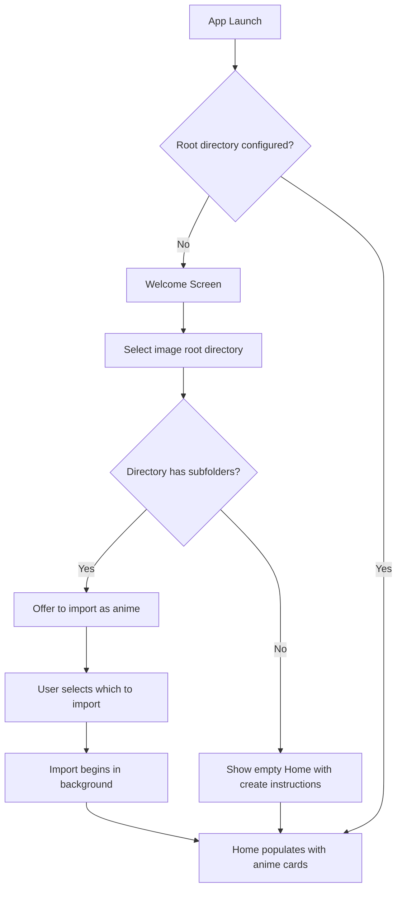
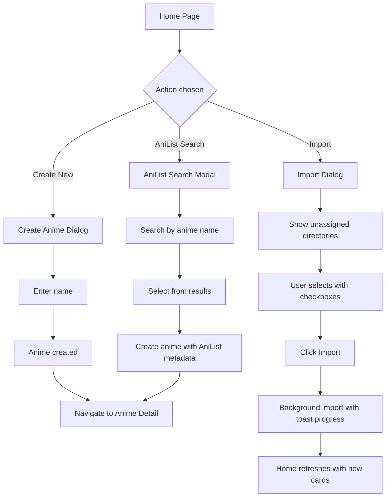
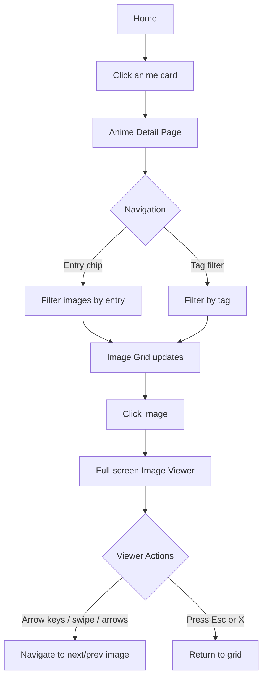
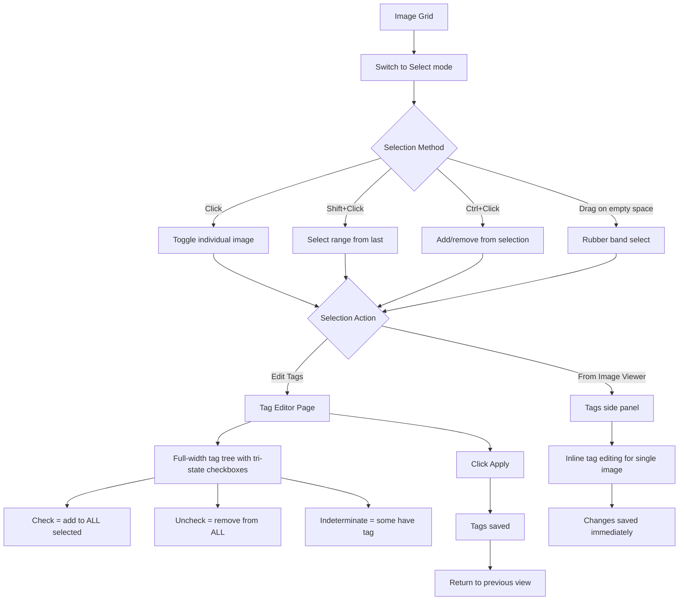
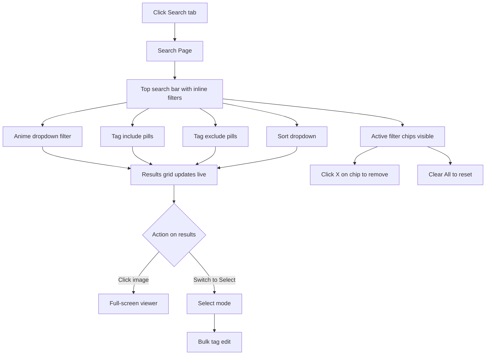
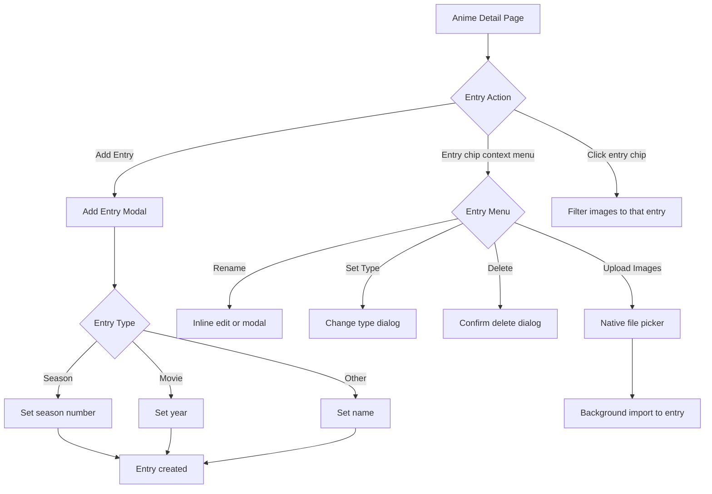
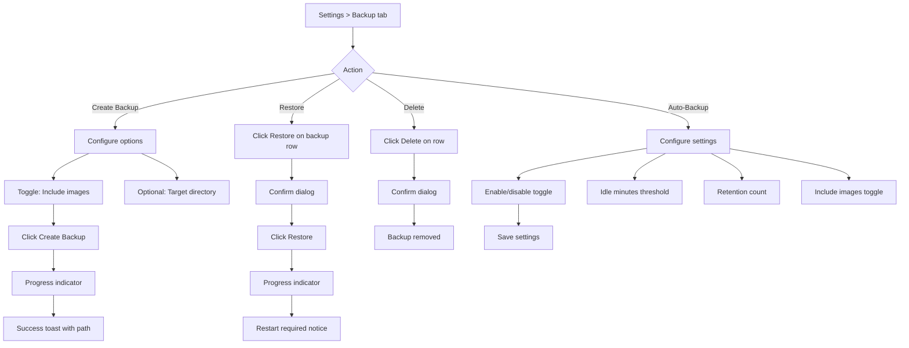
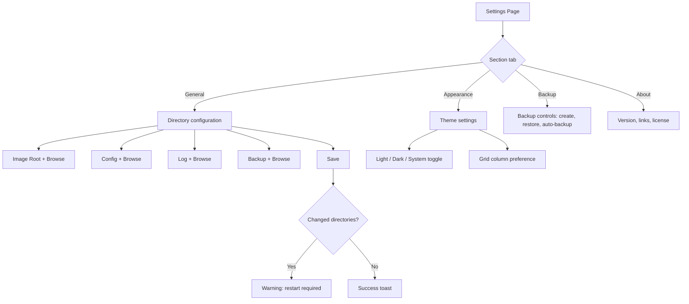

# UX Redesign v2: AnimeVault (Anime Image Viewer/Organizer)

## 1. Design Overview

### Design Philosophy

This redesign v2 takes a fundamentally different approach from v1. Rather than reskinning the existing admin-panel layout, we rethink every screen from scratch, drawing inspiration from the best modern consumer apps:

- **Google Photos** -- Inline filter chips above a full-width results grid. No sidebars on search.
- **Pinterest** -- Masonry grids that fill the viewport. Cards with preview images for discovery.
- **Netflix / Crunchyroll** -- Hero sections with featured content. Horizontal scrollable strips for categories.
- **Spotify** -- Minimal chrome, dark-first design, search as a first-class experience.
- **Linear** -- Command palette (Ctrl+K), keyboard-first, icon rail navigation.
- **AniList** -- Anime profile pages with hero headers and metadata chips.

### What Changed from v1

1. **"Library" renamed to "Home"** everywhere.
2. **Folders page removed entirely.** Users never see or interact with folders. The app manages filesystem organization internally.
3. **ML tag suggestions removed entirely.** No confidence sliders, no suggestion panels, no "ML" references anywhere.
4. **Desktop wireframes at 1440x900.** Supports up to 4K but wireframes are designed at common desktop resolution.
5. **Search has NO sidebars.** Inline filter chips directly above full-width results (Google Photos style).
6. **Anime Detail has NO left panel.** Clean header with anime name, compact entry tabs, wall-to-wall masonry grid. Images are the hero.
7. **Tag Management uses visual cards** with preview images, not a tree+detail panel split. Characters are anime metadata, NOT tags.
8. **Navigation reduced to 4 items:** Home, Search, Tags, and Settings (below divider). Backup is a section within Settings.
9. **Dark theme as default.** Modern, image-focused aesthetic.
10. **Advanced select mode** with rubber band/lasso selection, shift+click range, ctrl+click toggle.
11. **Image Viewer is minimal:** Full-screen image, close button, subtle nav arrows. Nothing else.

### Key Design Decisions

1. **No sidebars on content pages** -- Every content page (Search, Anime Detail, Tag Management) uses full-width layouts. Filters and metadata appear as inline chips, hero headers, or horizontal tabs. This maximizes image display area, especially on 4K screens.

2. **Icon Rail sidebar (desktop) + 4-Tab Bottom Bar (mobile)** -- The 64px icon rail on desktop keeps navigation accessible without stealing content space. Mobile uses exactly 4 tabs: Home, Search, Tags, Settings.

3. **Command Palette (Ctrl+K)** -- Power-user access to any anime, tag, or action without leaving the current page.

4. **Clean headers on detail pages** -- Anime Detail uses a compact header with anime name and metadata, then immediately transitions to the image grid. No hero banner -- images are the hero.

5. **Entry chips, not entry trees** -- Entries appear as horizontal pill tabs, not an expandable sidebar tree. Click a chip to filter the image grid. Much simpler.

6. **Manual tagging only** -- The Image Tag Editor is a clean, full-width tri-state checkbox layout organized by category. No ML panel, no confidence sliders.

7. **Rubber band selection** -- Users can click and drag on empty space to draw a selection rectangle. This is the most intuitive way to select multiple images with a mouse.

### Design Tokens

```
Colors (Dark -- default):
  --background:     #0f0f14
  --surface:        #1e1e2e
  --surface-alt:    #16161e
  --primary:        #818cf8 (Indigo 400)
  --primary-hover:  #6366f1 (Indigo 500)
  --primary-subtle: #312e81 (Indigo 900)
  --text:           #f1f5f9
  --text-secondary: #94a3b8
  --text-muted:     #64748b
  --text-dim:       #475569
  --border:         #2d2d3f
  --danger:         #fca5a5
  --danger-bg:      #3b1a1a
  --success:        #6ee7b7
  --success-bg:     #1a3a2e
  --warning:        #fcd34d
  --warning-bg:     #3b2600

Colors (Light):
  --background:     #fafafa
  --surface:        #ffffff
  --surface-alt:    #f8fafc
  --primary:        #6366f1 (Indigo 500)
  --primary-hover:  #4f46e5 (Indigo 600)
  --primary-subtle: #eef2ff (Indigo 50)
  --text:           #111827
  --text-secondary: #6b7280
  --text-muted:     #9ca3af
  --border:         #e5e7eb

Spacing: 4px base unit (4, 8, 12, 16, 24, 32, 48, 64, 80)
Border Radius: 6px (small), 10px (medium), 16px (large), 24px (pill)
Font: Inter
```

---

## 2. User Flows

### 2.1 First-Time Setup



### 2.2 Adding New Anime



### 2.3 Browsing and Viewing Images



### 2.4 Tagging Images (Manual Only)



### 2.5 Searching and Filtering



### 2.6 Managing Anime Entries



### 2.7 Backup and Restore



### 2.8 Settings



---

## 3. Screen Layouts

### 3.1 Home

**Desktop (1440x900):**


**Mobile (375x812):**


**Components:**
- 64px icon rail sidebar (desktop) / 4-tab bottom bar (mobile: Home, Search, Tags, Settings)
- Compact top bar with page title, stats, search bar, and action buttons
- Netflix-style cover card grid with gradient overlay, anime name overlaid at bottom
- Image count badge on each card
- 5 columns on desktop, 2 on mobile

**Layout Notes:**
- Clean, tight layout with no wasted space
- Cards are cover-image-forward with bottom gradient overlay for title
- Dark theme default: `#0f0f14` background

### 3.2 Anime Detail (Tabbed Page)

The anime detail page uses **primary tabs** to organize all browsing and management into one page. No modal dialogs.

**Tabs:** Images (default) | Entries | Characters | Tags | Info

#### 3.2.1 Images Tab (Default)

**Desktop (1440x900):**


**Mobile (375x812):**


**Components:**
- Header: breadcrumb, anime name, entry count, image count, Upload button, "..." overflow menu
- Primary tab bar: Images (active) | Entries | Characters | Tags | Info
- Entry sub-filter tabs below: All | Season 1 | Season 2 | etc.
- Inline toolbar: tag filter, sort dropdown, view/select toggle
- Wall-to-wall masonry image grid (5 columns desktop, 2 mobile)

#### 3.2.2 Entries Tab

**Desktop (1440x900):**


**Mobile (375x812):**


**Components:**
- Full-width entries table with column headers: TYPE | NAME | AIRING | IMAGES | ACTIONS
- Entry rows with type badges (S1, S2, S3, M), inline editing, expand/collapse for sub-entries
- Sub-entries indented with tree-connector lines (e.g., Season 3 → Part 1, Part 2)
- Add Entry form at bottom: type selector (Season/Movie/Other), season #, airing, year
- Mobile: card-style rows, tappable to expand, swipe for edit/delete actions

**Interaction Patterns:**
- Click entry name to enter inline edit mode (row highlights with indigo border, Save/Cancel appear)
- Expand arrow reveals indented sub-entries with tree-connector lines
- Upload button per entry opens native file picker
- Delete buttons use `#ef4444` danger color

#### 3.2.3 Characters Tab

**Desktop (1440x900):**


**Components:**
- Character card grid (~172px wide cards)
- Each card: character image placeholder, AniList badge, character name, role, image count
- "Edit Mode" toggle in toolbar to enable delete buttons on cards
- Search bar for filtering characters
- "+ Add Character" dashed card at end
- Characters are linked from AniList

#### 3.2.4 Tags Tab

**Desktop (1440x900):**


**Components:**
- Tag chips organized by category: Scene/Action, Nature/Weather, Location, Mood
- Active tags: filled indigo chip. Inactive: ghost/outline chip.
- Click to toggle tag on/off for this anime
- This is for assigning which tags apply to this anime, NOT global tag management

#### 3.2.5 Info Tab

**Desktop (1440x900):**


**Components:**
- Centered form (max-width ~600px)
- Title field (editable text input)
- AniList link section with status indicator and "Open in AniList" button
- Description textarea
- Save Changes button
- Danger Zone: "Delete this anime" with red border and confirmation

### 3.3 Image Viewer

**Desktop (1440x900):**


**Mobile (375x812):**


**Components:**
- Full-screen dark overlay
- Full-screen image
- Close button (X, top-left)
- Subtle left/right navigation arrows (on hover)
- Nothing else. No counter, no filename, no zoom controls, no tag panel, no thumbnails.

### 3.4 Search

**Desktop (1440x900):**


**Mobile (375x812):**


**Components:**
- Large search bar at top
- Inline filter bar: Anime dropdown, Tag include/exclude pills, Sort dropdown
- Full-width masonry results grid (5 columns desktop)
- NO sidebar filter panel, NO folder filter, NO filename filter

### 3.5 Tag Management

**Desktop (1440x900):**


**Mobile (375x812):**


**Components:**
- Tags grouped by collapsible category sections (Scene/Action, Nature/Weather, Location, Mood, Uncategorized)
- Category headers: color indicator bar, name, tag count, expand/collapse chevron
- Tag rows: name, image count, anime association chips (2-letter abbreviations), edit/delete actions
- Anime-specific tags show which anime they belong to via small colored chips
- "+ New Tag" and "+ New Category" buttons in header
- Search filters across all categories, auto-expands matching sections
- NO character names as tags -- characters are anime metadata managed on anime detail page
- NO flat card grid -- grouped list is denser and more scannable

### 3.6 Image Tag Editor

**Desktop (1440x900):**


**Mobile (375x812):**


**Components:**
- Selected images strip, tag search, pending changes bar
- Full-width tri-state checkboxes in multi-column layout (Scenes, Locations, Mood/Weather)
- Visual states: green for adding, red for removing
- NO ML panel, NO confidence slider, NO character names

### 3.7 Settings (includes Backup)

**Desktop (1440x900):**


**Mobile (375x812):**


**Components:**
- Horizontal section tabs: General, Appearance, **Backup**, About
- Backup is a tab within Settings, not a separate page
- Centered form layout
- Mobile: iOS-style grouped list with Backup section

### 3.8 Select Mode

**Desktop (1440x900):**


**Components:**
- Indigo selection action bar with count and actions
- Rubber band selection rectangle (dashed indigo border)
- Selected images: indigo border + tint + filled checkbox
- Hint bar: Click, Shift+Click, Ctrl+Click, Drag

### 3.9 Navigation Pattern

**Reference:**


**Desktop:** 64px icon rail (Home, Search, Tags | Settings), expands to 180px on hover
**Mobile:** 4-tab bottom bar (Home, Search, Tags, Settings) -- No "More" menu, Backup is under Settings

---

## 4. Component Specifications

### 4.1 Anime Card

**States:**
- Default: Dark surface, cover image, info
- Hover: Scale 1.02, glow border
- Active: Scale 0.98
- Loading: Skeleton placeholder
- Empty: Gradient placeholder

### 4.2 Image Thumbnail

**States:**
- Default: Image with 12px radius
- Hover: Brightness overlay
- Selected: 4px indigo border, checkbox, 15% tint
- Rubber band pending: 3px dashed border, 10% tint
- Loading: Skeleton
- Error: Broken image icon

### 4.3 Tag Chip

**Category Colors (Dark):**
- Scene/Action: `#312e81` / `#818cf8`
- Nature/Weather: `#1a3a2e` / `#6ee7b7`
- Location: `#3b2600` / `#fcd34d`
- Mood/Genre: `#3b1a1a` / `#fca5a5`
- Uncategorized: `#1e1e2e` / `#94a3b8`

### 4.4 Tri-State Checkbox

**States:**
- Unchecked: Transparent, dim border
- Checked: Primary fill, white checkmark
- Indeterminate: Transparent, primary border, dash
- Adding: Green highlight row
- Removing: Red highlight row, strikethrough

### 4.5 Command Palette

- Ctrl+K to open, Esc to close
- Results grouped: Anime, Tags, Actions
- Arrow keys to navigate, Enter to select

---

## 5. Select Mode Specification

### 5.1 Selection Methods

| Method | Action | Keyboard |
|--------|--------|----------|
| Click | Toggle single image | -- |
| Shift+Click | Select range from last selected | Shift held |
| Ctrl+Click | Add/remove without clearing | Ctrl/Cmd held |
| Drag on empty space | Rubber band rectangle selection | -- |
| Ctrl+A | Select all in current view | Ctrl+A |

### 5.2 Rubber Band Details
- Initiated by mousedown on grid empty space (not on an image)
- Semi-transparent indigo fill (8% opacity), dashed indigo border
- Images intersecting the rectangle are "pending selected" with dashed border
- On mouseup, pending become selected
- Ctrl+drag adds to existing selection without clearing

### 5.3 Visual Feedback
- Selected: 4px indigo border + 15% tint + filled checkbox
- Pending: 3px dashed border + 10% tint + half-filled checkbox
- Unselected: Empty checkbox (only visible in select mode)
- Action bar: Full-width indigo bar with count, Select All, Clear, Edit Tags, Done

---

## 6. Responsive Design

### 6.1 Breakpoints

| Breakpoint | Width | Grid Columns |
|------------|-------|--------------|
| Mobile | 0-639px | 2 |
| Tablet | 640-1023px | 3-4 |
| Desktop | 1024-2559px | 5-6 |
| 4K | 2560px+ | 6-8 |

### 6.2 Navigation

| Size | Pattern |
|------|---------|
| Desktop | 64px icon rail, expands 180px on hover |
| Tablet | 64px icon rail, no expand |
| Mobile | 4-tab bottom bar (Home, Search, Tags, Settings) |

---

## 7. Accessibility

- All interactive elements keyboard-focusable
- 2px primary focus ring
- Semantic HTML with ARIA landmarks
- Color contrast AA minimum (4.5:1 body, 3:1 large text)
- `prefers-reduced-motion` respected
- Touch targets 44x44px minimum
- Rubber band selection announces count via live region

---

## Wireframe File Index

| File | Description |
|------|-------------|
| `01-home-desktop.svg` | Home with cover card grid (1440x900) |
| `01-home-mobile.svg` | Home with bottom tabs (375x812) |
| `02-anime-detail-desktop.svg` | Clean header + entry tabs + wall-to-wall image grid (1440x900) |
| `02-anime-detail-mobile.svg` | Compact header + tabs + 2-col grid (375x812) |
| `02a-manage-entries-desktop.svg` | Manage dialog -- Entries tab with inline editing + sub-entries (1440x900) |
| `02b-manage-characters-desktop.svg` | Manage dialog -- Characters tab with inline rename (1440x900) |
| `02c-manage-tags-desktop.svg` | Manage dialog -- Tags tab with color-coded tags (1440x900) |
| `02d-manage-info-desktop.svg` | Manage dialog -- Info tab with AniList + danger zone (1440x900) |
| `02e-manage-mobile.svg` | Manage dialog -- Mobile full-screen with action sheet (375x812) |
| `02f-entry-context-menu-desktop.svg` | Entry tab right-click context menu (1440x900) |
| `03-image-viewer-desktop.svg` | Minimal viewer: image + close + arrows (1440x900) |
| `03-image-viewer-mobile.svg` | Minimal viewer: image + close + arrows (375x812) |
| `04-search-desktop.svg` | Inline filters + full-width results (1440x900) |
| `04-search-mobile.svg` | Search bar + filter chips + results (375x812) |
| `05-tag-management-desktop.svg` | Tag cards with real tags only, no characters (1440x900) |
| `05-tag-management-mobile.svg` | Tag list with real tags only (375x812) |
| `06-image-tag-editor-desktop.svg` | Full-width tri-state checkboxes, no ML (1440x900) |
| `06-image-tag-editor-mobile.svg` | Single-column tag checkboxes (375x812) |
| `08-settings-desktop.svg` | Settings with Backup tab (1440x900) |
| `08-settings-mobile.svg` | iOS-style settings with Backup section (375x812) |
| `09-select-mode-desktop.svg` | Rubber band selection shown (1440x900) |
| `10-navigation-pattern.svg` | 4-item icon rail + 4-tab mobile bottom bar (1440x600) |
