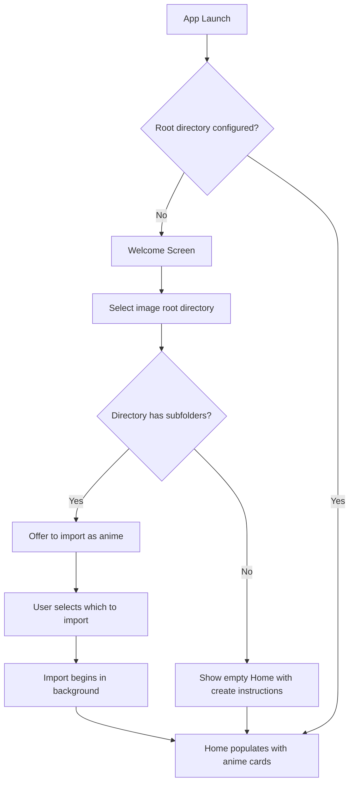
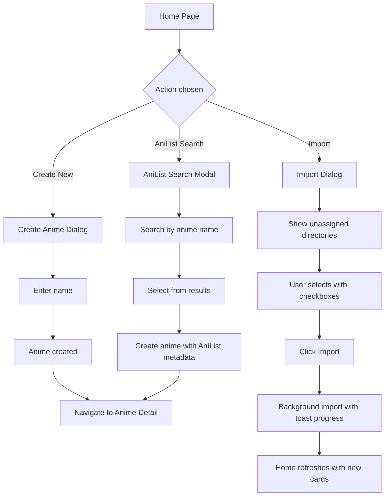
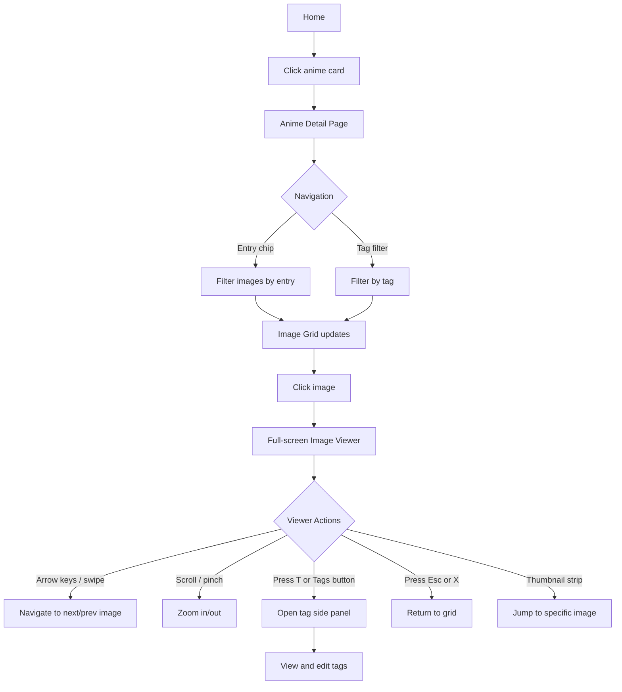
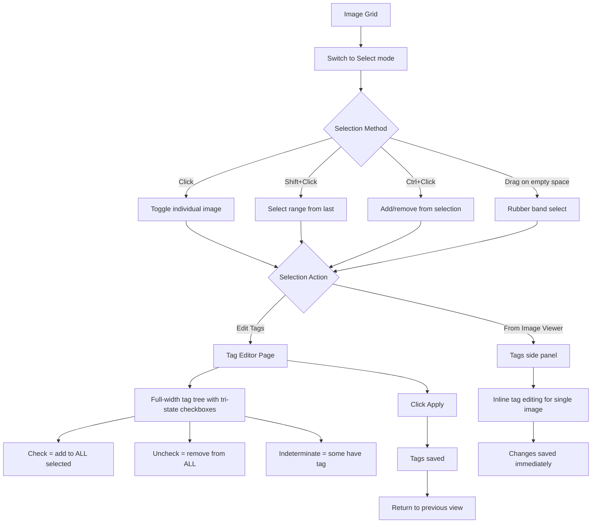
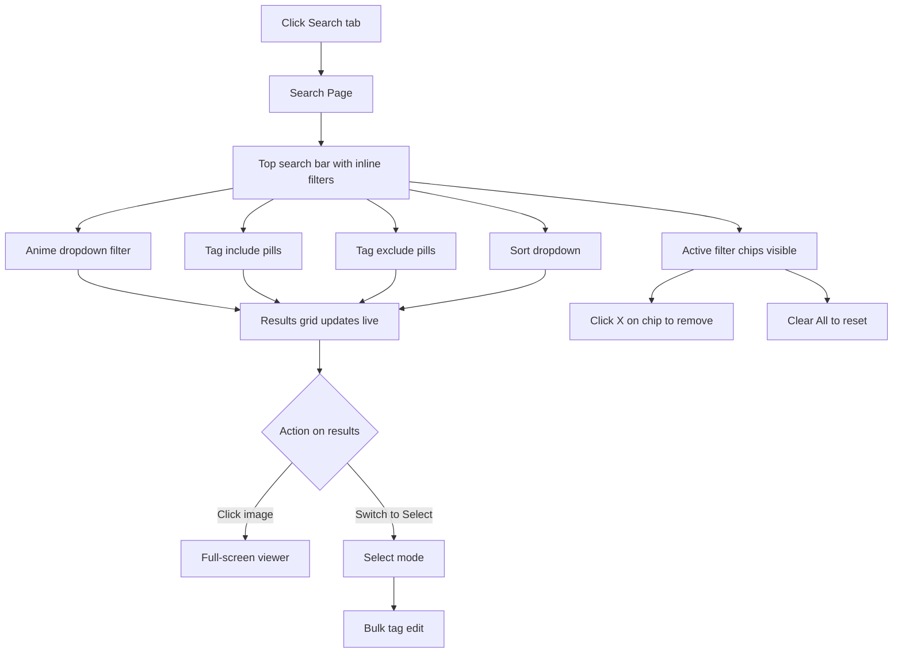
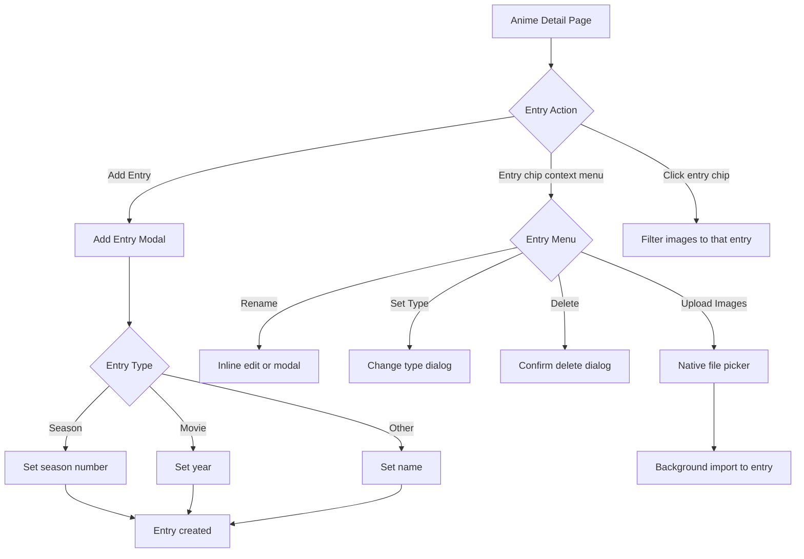
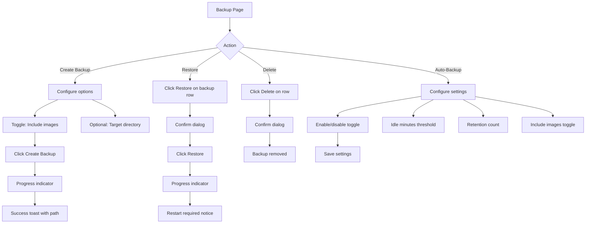
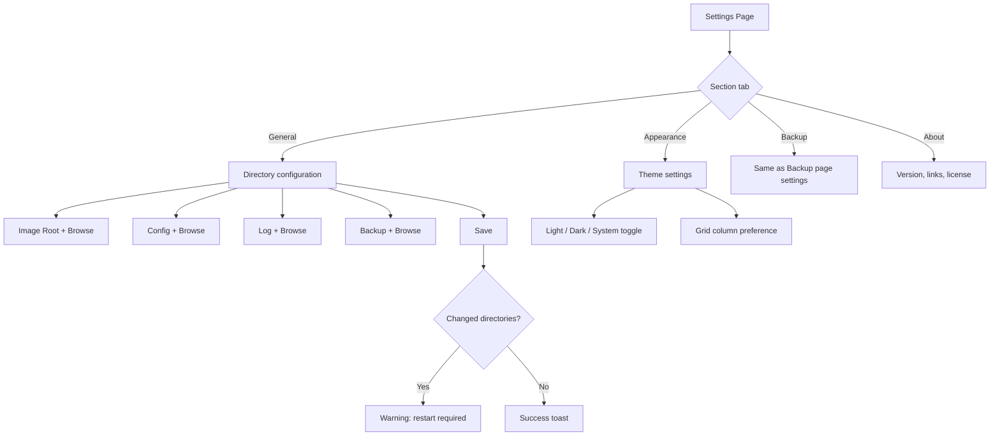

# UX Redesign v2: AnimeVault (Anime Image Viewer/Organizer)

## 1. Design Overview

### Design Philosophy

This redesign v2 takes a fundamentally different approach from v1. Rather than reskinning the existing admin-panel layout, we rethink every screen from scratch, drawing inspiration from the best modern consumer apps:

- **Google Photos** -- Inline filter chips above a full-width results grid. No sidebars on search.
- **Pinterest** -- Masonry grids that fill the viewport. Cards with preview images for discovery.
- **Netflix / Crunchyroll** -- Hero sections with featured content. Horizontal scrollable strips for categories.
- **Spotify** -- Minimal chrome, dark-first design, search as a first-class experience.
- **Linear** -- Command palette (Ctrl+K), keyboard-first, icon rail navigation.
- **AniList** -- Anime profile pages with hero headers and metadata chips.

### What Changed from v1

1. **"Library" renamed to "Home"** everywhere.
2. **Folders page removed entirely.** Users never see or interact with folders. The app manages filesystem organization internally.
3. **ML tag suggestions removed entirely.** No confidence sliders, no suggestion panels, no "ML" references anywhere.
4. **Desktop targets 4K (3840x2160)** instead of 1440px. More columns, more content visible.
5. **Search has NO sidebars.** Inline filter chips directly above full-width results (Google Photos style).
6. **Anime Detail has NO left panel.** Hero header with metadata, horizontal entry chips, full-width masonry grid (AniList/Pinterest style).
7. **Tag Management uses visual cards** with preview images, not a tree+detail panel split.
8. **Navigation reduced to 4 items:** Home, Search, Tags, and a divider before Backup and Settings.
9. **Dark theme as default.** Modern, image-focused aesthetic.
10. **Advanced select mode** with rubber band/lasso selection, shift+click range, ctrl+click toggle.

### Key Design Decisions

1. **No sidebars on content pages** -- Every content page (Search, Anime Detail, Tag Management) uses full-width layouts. Filters and metadata appear as inline chips, hero headers, or horizontal tabs. This maximizes image display area, especially on 4K screens.

2. **Icon Rail sidebar (desktop) + 4-Tab Bottom Bar (mobile)** -- The 80px icon rail on desktop keeps navigation accessible without stealing content space. Mobile uses exactly 4 tabs: Home, Search, Tags, More.

3. **Command Palette (Ctrl+K)** -- Power-user access to any anime, tag, or action without leaving the current page.

4. **Hero headers on detail pages** -- Anime Detail uses a full-width hero banner with cover image background, metadata overlay, and action buttons. This replaces the old left-panel tree approach.

5. **Entry chips, not entry trees** -- Entries appear as horizontal pill tabs, not an expandable sidebar tree. Click a chip to filter the image grid. Much simpler.

6. **Manual tagging only** -- The Image Tag Editor is a clean, full-width tri-state checkbox layout organized by category. No ML panel, no confidence sliders.

7. **Rubber band selection** -- Users can click and drag on empty space to draw a selection rectangle. This is the most intuitive way to select multiple images with a mouse.

### Design Tokens

```
Colors (Dark -- default):
  --background:     #0f0f14
  --surface:        #1e1e2e
  --surface-alt:    #16161e
  --primary:        #818cf8 (Indigo 400)
  --primary-hover:  #6366f1 (Indigo 500)
  --primary-subtle: #312e81 (Indigo 900)
  --text:           #f1f5f9
  --text-secondary: #94a3b8
  --text-muted:     #64748b
  --text-dim:       #475569
  --border:         #2d2d3f
  --danger:         #fca5a5
  --danger-bg:      #3b1a1a
  --success:        #6ee7b7
  --success-bg:     #1a3a2e
  --warning:        #fcd34d
  --warning-bg:     #3b2600

Colors (Light):
  --background:     #fafafa
  --surface:        #ffffff
  --surface-alt:    #f8fafc
  --primary:        #6366f1 (Indigo 500)
  --primary-hover:  #4f46e5 (Indigo 600)
  --primary-subtle: #eef2ff (Indigo 50)
  --text:           #111827
  --text-secondary: #6b7280
  --text-muted:     #9ca3af
  --border:         #e5e7eb

Spacing: 4px base unit (4, 8, 12, 16, 24, 32, 48, 64, 80)
Border Radius: 6px (small), 10px (medium), 16px (large), 24px (pill)
Font: Inter
```

---

## 2. User Flows

### 2.1 First-Time Setup



### 2.2 Adding New Anime



### 2.3 Browsing and Viewing Images



### 2.4 Tagging Images (Manual Only)



### 2.5 Searching and Filtering



### 2.6 Managing Anime Entries



### 2.7 Backup and Restore



### 2.8 Settings



---

## 3. Screen Layouts

### 3.1 Home

**Desktop (3840x2160):**


**Mobile (375x812):**


**Components:**
- 80px icon rail sidebar (desktop) / 4-tab bottom bar (mobile)
- Hero area with page title, stats, search bar, and quick action buttons
- "Recently Updated" horizontal strip with compact anime cards showing recent activity
- Collection grid: 6 columns on 4K desktop, 2 columns on mobile
- Each card: cover image, anime name, entry count, image count, latest entry badge
- Import progress toast (floating, bottom-right)

**Layout Notes:**
- Netflix/Crunchyroll-inspired layout: hero section at top, then scrollable grid
- No top bar -- the icon rail handles navigation, search is prominent in the hero
- Grid uses CSS Grid with `auto-fill, minmax(520px, 1fr)` for fluid 4K columns
- Dark theme default: `#0f0f14` background, `#1e1e2e` card surfaces

### 3.2 Anime Detail

**Desktop (3840x2160):**


**Mobile (375x812):**


**Components:**
- Full-width hero header with blurred cover image, anime title, metadata, action buttons
- Horizontal entry chip tabs: "All Images", "Season 1", "Season 2", etc.
- Inline toolbar: image count, tag filter chip, sort dropdown, view/select toggle
- Full-width masonry image grid (7 columns at 4K, 2 on mobile)
- NO left panel, NO entry tree, NO folder section

**Layout Notes:**
- AniList profile + Pinterest board inspired
- Hero header fades to background via gradient overlay
- Entry chips replace the old sidebar tree
- Masonry grid fills entire width minus icon rail

### 3.3 Image Viewer

**Desktop (3840x2160):**


**Mobile (375x812):**


**Components:**
- Full-screen dark overlay
- Main image with zoom/pan
- Semi-transparent top bar with controls
- Tag side panel (480px, desktop) / Bottom sheet (mobile)
- Bottom thumbnail strip
- NO ML suggestions

### 3.4 Search

**Desktop (3840x2160):**


**Mobile (375x812):**


**Components:**
- Large search bar at top
- Inline filter bar: Anime dropdown, Tag include/exclude pills, Sort dropdown
- Full-width masonry results grid
- NO sidebar filter panel, NO folder filter, NO filename filter

### 3.5 Tag Management

**Desktop (3840x2160):**


**Mobile (375x812):**


**Components:**
- Tag cards organized by category with preview image strips
- Each card: preview images, tag name, image count, anime count
- NO tree + detail panel split

### 3.6 Image Tag Editor

**Desktop (3840x2160):**


**Mobile (375x812):**


**Components:**
- Selected images strip, tag search, pending changes bar
- Full-width tri-state checkboxes in multi-column layout
- Visual states: green for adding, red for removing
- NO ML panel, NO confidence slider

### 3.7 Backup / Restore

**Desktop (3840x2160):**


**Mobile (375x812):**


**Components:**
- Centered card layout (max-width 1200px)
- Create, History, Auto-backup settings cards

### 3.8 Settings

**Desktop (3840x2160):**


**Mobile (375x812):**


**Components:**
- Horizontal section tabs (not left nav)
- Centered form layout
- Mobile: iOS-style grouped list

### 3.9 Select Mode

**Desktop (3840x2160):**


**Components:**
- Indigo selection action bar with count and actions
- Rubber band selection rectangle (dashed indigo border)
- Selected images: indigo border + tint + filled checkbox
- Hint bar: Click, Shift+Click, Ctrl+Click, Drag

### 3.10 Navigation Pattern

**Reference:**


**Desktop:** 80px icon rail (Home, Search, Tags | Backup, Settings), expands to 200px on hover
**Mobile:** 4-tab bottom bar (Home, Search, Tags, More), "More" opens bottom sheet

---

## 4. Component Specifications

### 4.1 Anime Card

**States:**
- Default: Dark surface, cover image, info
- Hover: Scale 1.02, glow border
- Active: Scale 0.98
- Loading: Skeleton placeholder
- Empty: Gradient placeholder

### 4.2 Image Thumbnail

**States:**
- Default: Image with 12px radius
- Hover: Brightness overlay
- Selected: 4px indigo border, checkbox, 15% tint
- Rubber band pending: 3px dashed border, 10% tint
- Loading: Skeleton
- Error: Broken image icon

### 4.3 Tag Chip

**Category Colors (Dark):**
- Character: `#312e81` / `#818cf8`
- Scene: `#1a3a2e` / `#6ee7b7`
- Location: `#3b2600` / `#fcd34d`
- Object: `#3b1a1a` / `#fca5a5`
- Uncategorized: `#1e1e2e` / `#94a3b8`

### 4.4 Tri-State Checkbox

**States:**
- Unchecked: Transparent, dim border
- Checked: Primary fill, white checkmark
- Indeterminate: Transparent, primary border, dash
- Adding: Green highlight row
- Removing: Red highlight row, strikethrough

### 4.5 Command Palette

- Ctrl+K to open, Esc to close
- Results grouped: Anime, Tags, Actions
- Arrow keys to navigate, Enter to select

---

## 5. Select Mode Specification

### 5.1 Selection Methods

| Method | Action | Keyboard |
|--------|--------|----------|
| Click | Toggle single image | -- |
| Shift+Click | Select range from last selected | Shift held |
| Ctrl+Click | Add/remove without clearing | Ctrl/Cmd held |
| Drag on empty space | Rubber band rectangle selection | -- |
| Ctrl+A | Select all in current view | Ctrl+A |

### 5.2 Rubber Band Details
- Initiated by mousedown on grid empty space (not on an image)
- Semi-transparent indigo fill (8% opacity), dashed indigo border
- Images intersecting the rectangle are "pending selected" with dashed border
- On mouseup, pending become selected
- Ctrl+drag adds to existing selection without clearing

### 5.3 Visual Feedback
- Selected: 4px indigo border + 15% tint + filled checkbox
- Pending: 3px dashed border + 10% tint + half-filled checkbox
- Unselected: Empty checkbox (only visible in select mode)
- Action bar: Full-width indigo bar with count, Select All, Clear, Edit Tags, Done

---

## 6. Responsive Design

### 6.1 Breakpoints

| Breakpoint | Width | Grid Columns |
|------------|-------|--------------|
| Mobile | 0-639px | 2 |
| Tablet | 640-1023px | 3-4 |
| Desktop | 1024-2559px | 5-6 |
| 4K | 2560px+ | 6-8 |

### 6.2 Navigation

| Size | Pattern |
|------|---------|
| Desktop | 80px icon rail, expands 200px on hover |
| Tablet | 80px icon rail, no expand |
| Mobile | 4-tab bottom bar (Home, Search, Tags, More) |

---

## 7. Accessibility

- All interactive elements keyboard-focusable
- 2px primary focus ring
- Semantic HTML with ARIA landmarks
- Color contrast AA minimum (4.5:1 body, 3:1 large text)
- `prefers-reduced-motion` respected
- Touch targets 44x44px minimum
- Rubber band selection announces count via live region

---

## Wireframe File Index

| File | Description |
|------|-------------|
| `01-home-desktop.svg` | Home with hero + collection grid (3840x2160) |
| `01-home-mobile.svg` | Home with bottom tabs (375x812) |
| `02-anime-detail-desktop.svg` | Hero header + entry chips + masonry grid (3840x2160) |
| `02-anime-detail-mobile.svg` | Compact hero + chips + 2-col grid (375x812) |
| `03-image-viewer-desktop.svg` | Full-screen viewer with tag panel (3840x2160) |
| `03-image-viewer-mobile.svg` | Full-screen viewer with bottom sheet (375x812) |
| `04-search-desktop.svg` | Inline filters + full-width results (3840x2160) |
| `04-search-mobile.svg` | Search bar + filter chips + results (375x812) |
| `05-tag-management-desktop.svg` | Tag cards by category with previews (3840x2160) |
| `05-tag-management-mobile.svg` | Tag list with thumbnails (375x812) |
| `06-image-tag-editor-desktop.svg` | Full-width tri-state checkboxes, no ML (3840x2160) |
| `06-image-tag-editor-mobile.svg` | Single-column tag checkboxes (375x812) |
| `07-backup-restore-desktop.svg` | Centered card layout (3840x2160) |
| `07-backup-restore-mobile.svg` | Stacked cards (375x812) |
| `08-settings-desktop.svg` | Horizontal section tabs + form (3840x2160) |
| `08-settings-mobile.svg` | iOS-style settings list (375x812) |
| `09-select-mode-desktop.svg` | Rubber band selection shown (3840x2160) |
| `10-navigation-pattern.svg` | Icon rail + mobile bottom bar comparison |
