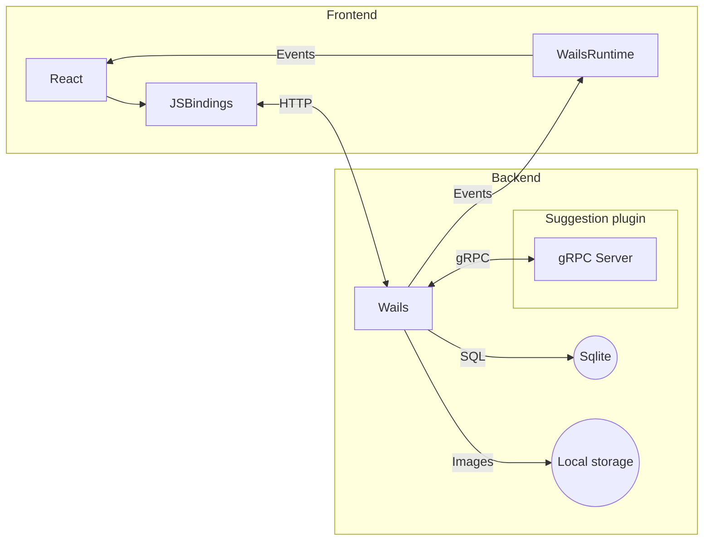

## Design
### Architecture

This is a rough overview of this application on a desktop.

### Framework

This appilcation uses [wails3](https://v3alpha.wails.io/) which is an alpha version, so it's expected there might be a breaking change over time.

### File structure

- `/main.go`, `/internal`: Wails3 code
- `/frontend`: Frontend built by Vite, React, React Router, and Joy UI.
- `/plugins/tag-suggestion`: A python code managed by PDM for preprocessing and training ViT model. This also includes gRPC server to start suggesting a tag

## Development

These commands do not include any plugin commands.
For each plugin, see its README.

### Development commands

You can see all tasks by `wails3 task --list-all`.

The useful commands for developing wails are followings:

#### `wails3 task dev`

This starts a development environment.

1. Run a gRPC tag suggestion server
2. Run a frontend dev server
3. Run a wails app

#### `wails3 task build:wsl:prod`

This builds an application for a Windows binary on Ubuntu of WSL 2.
This binary doesn't include a plugin like `tag-suggestion`, so it needs to run it separately.

#### `wails3 task train:prod`

- This command is to export images and their tags, preprocess those images and train a ML model using those datasets
