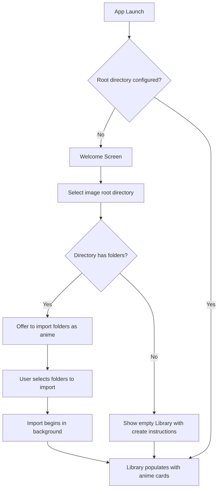
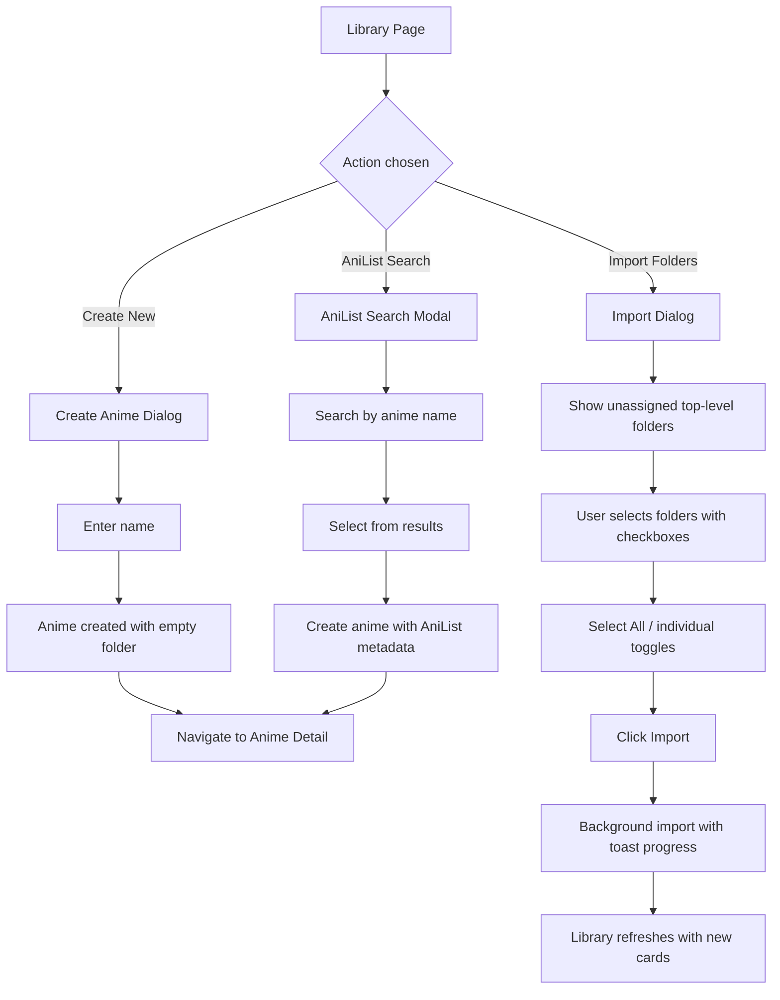
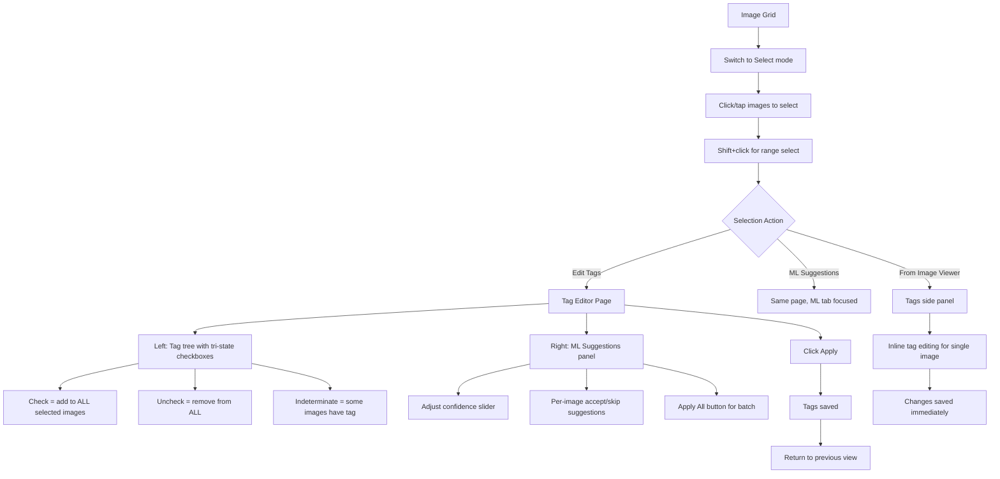
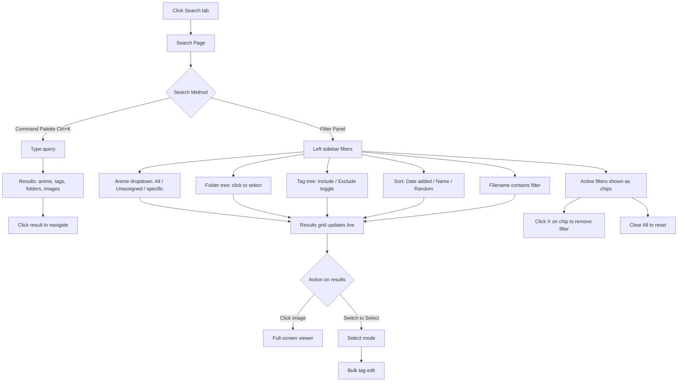
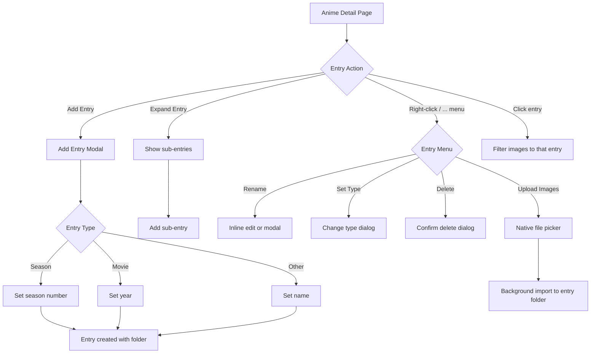
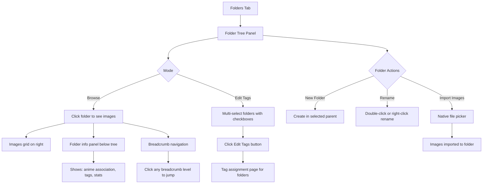
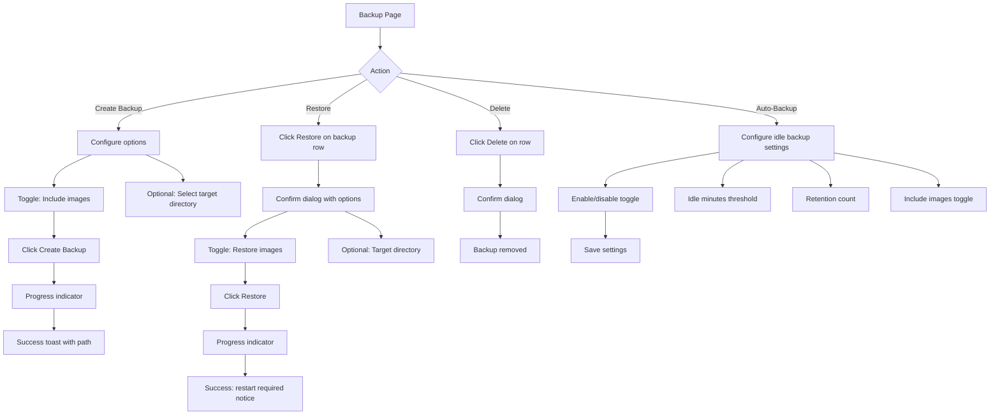
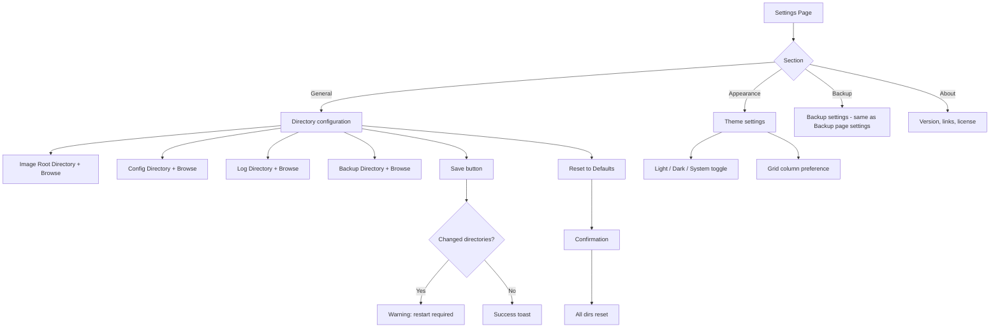

# UX Redesign: AnimeVault (Anime Image Viewer/Organizer)

## 1. Design Overview

### Design Philosophy

This redesign transforms the app from a Material UI admin-panel feel into a modern, image-centric collection manager. The key inspirations are:

- **Google Photos / Apple Photos** -- Masonry grids, smooth image browsing, full-screen viewer with gesture navigation
- **AniList** -- Collection card layouts, anime-specific metadata patterns
- **Linear / Notion** -- Clean minimal chrome, command palette (Ctrl+K), keyboard-first design
- **Finder / Files** -- Folder tree browsing patterns

### Key Design Decisions

1. **Drop MUI entirely** -- Replace with a headless component system (Radix UI / shadcn/ui style) with Tailwind CSS. This gives full design control, smaller bundle, and modern aesthetics without fighting an opinionated component library.

2. **Icon Rail sidebar (desktop) + Bottom Tab Bar (mobile)** -- The current 6-item sidebar takes too much horizontal space. An icon rail at 64px (expanding to 200px on hover) saves space while keeping navigation always accessible. Mobile gets a standard 5-tab bottom bar.

3. **Command Palette** -- A Ctrl+K searchable command palette provides fast access to any anime, tag, folder, or action without leaving the current page. This is the single most impactful UX improvement for power users.

4. **Image-first layouts** -- Images are the hero. Cards use cover images, grids fill the viewport, the full-screen viewer has inline tag editing so users never leave the image context.

5. **Unified Tag Editor** -- Instead of separate pages for manual tagging and ML suggestions, combine them in a single split view. Manual tags on the left, ML suggestions on the right.

6. **Consolidated navigation** -- 4 primary tabs (Library, Search, Folders, Tags) with secondary pages (Backup, Settings) under "More" on mobile and at the bottom of the sidebar on desktop.

### Design Tokens

```
Colors (Light):
  --background:     #fafafa
  --surface:        #ffffff
  --primary:        #6366f1 (Indigo 500)
  --primary-hover:  #4f46e5 (Indigo 600)
  --primary-subtle: #eef2ff (Indigo 50)
  --text:           #111827
  --text-secondary: #6b7280
  --text-muted:     #9ca3af
  --border:         #e5e7eb
  --danger:         #dc2626
  --success:        #16a34a
  --warning:        #f59e0b

Colors (Dark):
  --background:     #0f0f14
  --surface:        #1e1e2e
  --primary:        #818cf8 (Indigo 400)
  --text:           #f1f5f9
  --border:         #2d2d3f

Spacing: 4px base unit (4, 8, 12, 16, 24, 32, 48, 64)
Border Radius: 6px (small), 10px (medium), 16px (large)
Font: Inter (already in the project)
```

---

## 2. User Flows

### 2.1 First-Time Setup



### 2.2 Importing New Anime / Folders



### 2.3 Browsing and Viewing Images

```mermaid
flowchart TD
    A[Library] --> B[Click anime card]
    B --> C[Anime Detail Page]
    C --> D{Navigation}

    D -->|Entry Tab| E[Filter images by entry/season]
    D -->|Character Chip| F[Filter images by character]
    D -->|Tag Filter| G[Filter by tag dropdown]

    E --> H[Image Grid updates]
    F --> H
    G --> H

    H --> I[Click image]
    I --> J[Full-screen Image Viewer]

    J --> K{Viewer Actions}
    K -->|Arrow keys / swipe| L[Navigate to next/prev image]
    K -->|Pinch / scroll| M[Zoom in/out]
    K -->|Press T or Tags button| N[Open tag side panel]
    N --> O[View current tags]
    N --> P[See ML suggestions]
    N --> Q[Quick-apply suggested tags]
    K -->|Press Esc or X| R[Return to grid]
    K -->|Thumbnail strip| S[Jump to specific image]
```



### 2.4 Tagging Images (Manual + ML Suggestions)



### 2.5 Searching and Filtering



### 2.6 Managing Anime Entries



### 2.7 Folder Organization



### 2.8 Backup and Restore



### 2.9 Settings



---

## 3. Screen Layouts

### 3.1 Home / Anime Library

**Desktop (1440px):** `wireframes/01-home-library-desktop.svg`
**Mobile (375px):** `wireframes/01-home-library-mobile.svg`

**Components:**
- Global top bar with search, theme toggle, settings
- Icon rail sidebar (desktop) / Bottom tab bar (mobile)
- Page header with title, stats, action buttons (Add Anime, Import)
- Filter/sort bar with text filter, grid/list toggle, sort dropdown
- Anime card grid (4 columns desktop, 2 columns mobile)
- Each card: cover image, anime name, image count, latest entry badge
- Import progress toast (bottom-right corner)

**Layout Notes:**
- Cards use aspect ratio for covers, preventing layout shift during load
- Grid uses CSS Grid with `auto-fill` and `minmax(280px, 1fr)` for fluid columns
- Empty state shows clear CTA to create or import
- Mobile cards are compact with smaller cover images

### 3.2 Anime Detail

**Desktop (1440px):** `wireframes/02-anime-detail-desktop.svg`
**Mobile (375px):** `wireframes/02-anime-detail-mobile.svg`

**Components:**
- Breadcrumb navigation (Library > Anime Name)
- Left panel (desktop): Entry tree, character chips, tag chips, folder tree
- Entry tabs (mobile): horizontal scrollable pill tabs
- Action buttons: Edit, + Entry, ... (more menu)
- Image grid with view/select toggle and tag filter
- Upload button for adding images

**Layout Notes:**
- Desktop: 320px left panel + fluid right panel
- Mobile: stacked layout -- metadata collapsed into chips above image grid
- Entry tree supports expand/collapse with sub-entries
- Character and tag chips are scrollable on mobile
- Clicking an entry filters the image grid

### 3.3 Image Viewer

**Desktop (1440px):** `wireframes/03-image-viewer-desktop.svg`
**Mobile (375px):** `wireframes/03-image-viewer-mobile.svg`

**Components:**
- Full-screen dark overlay
- Main image with zoom/pan (react-zoom-pan-pinch)
- Top bar: close, image counter, filename, zoom controls, info toggle, tag button
- Left/right navigation arrows
- Bottom thumbnail strip for quick jumping
- Optional right side panel for tag editing (desktop)
- Bottom sheet for tag editing (mobile)
- ML suggestion tags with confidence percentages

**Layout Notes:**
- UI elements auto-hide after 3 seconds of no interaction, reappear on mouse move
- Desktop: tag panel slides in from right (320px), image area adjusts
- Mobile: tag info in bottom sheet, swipe-down to dismiss
- Keyboard shortcuts prominently displayed
- Thumbnail strip scrolls horizontally, current image highlighted

### 3.4 Search / Filter

**Desktop (1440px):** `wireframes/04-search-desktop.svg`
**Mobile (375px):** `wireframes/04-search-mobile.svg`

**Components:**
- Search bar (focused state with highlighted border)
- Filter panel: Anime dropdown, Folder tree, Tag tree with Include/Exclude toggle
- Active filter chips (removable)
- Sort dropdown (Date added, Name, Random)
- Filename text filter
- Results grid with anime label overlays
- View/Select mode toggle
- Grid density slider (desktop)

**Layout Notes:**
- Desktop: 300px filter panel + fluid results grid
- Mobile: search bar + filter chips visible; full filter panel opens as bottom sheet via filter button
- Results show anime name overlay on each image
- Live-updating results as filters change
- Grid density adjustable on desktop for preference

### 3.5 Tag Management

**Desktop (1440px):** `wireframes/05-tag-management-desktop.svg`
**Mobile (375px):** `wireframes/05-tag-management-mobile.svg`

**Components:**
- Tag tree panel with search, grouped by category
- Image count per tag
- Tag detail panel: category dropdown, folders with tag, image previews
- Tag actions: Rename, Merge, Delete
- New tag button
- Category headers (Characters, Scenes, Locations, Objects, Uncategorized)

**Layout Notes:**
- Desktop: 380px tag list panel + fluid detail panel
- Mobile: full-width list view; tap row to navigate to detail; long-press for actions
- Tag tree is collapsible by category
- Preview images are horizontally scrollable
- Merge opens a modal with searchable tag target list

### 3.6 Image Tag Editor

**Desktop (1440px):** `wireframes/06-image-tag-editor-desktop.svg`
**Mobile (375px):** `wireframes/06-image-tag-editor-mobile.svg`

**Components:**
- Selected images thumbnail strip (top)
- Left panel: Tag tree with tri-state checkboxes (checked, unchecked, indeterminate)
- Right panel: ML suggestion cards (image + current tags + suggested tags)
- Confidence slider
- Per-image accept/skip for suggestions
- Apply All batch button
- Pending changes summary bar
- Cancel / Apply buttons

**Layout Notes:**
- Desktop: side-by-side split between manual tags and ML suggestions
- Mobile: tabs to switch between manual and ML views
- Tri-state checkboxes show shared tag state across multi-selection
- Indeterminate state means "some selected images have this tag"
- Pending changes shown as a summary bar before applying

### 3.7 Folder Management

**Desktop (1440px):** `wireframes/07-folder-management-desktop.svg`
**Mobile (375px):** `wireframes/07-folder-management-mobile.svg`

**Components:**
- Folder tree panel with image counts
- Browse / Edit Tags mode toggle
- New Folder button
- Folder info section (selected folder: anime association, tags, stats)
- Folder actions: Rename, Edit Tags, Import
- Breadcrumb navigation
- Image grid for selected folder
- View/Select mode for images

**Layout Notes:**
- Desktop: tree panel (380px) + images grid
- Mobile: drill-down navigation like a file browser (tap folder to enter, breadcrumbs to go back)
- Desktop tree is always visible; mobile replaces content
- Double-click folder name to rename inline (desktop)
- Tags shown as colored chips on folder info

### 3.8 Backup / Restore

**Desktop (1440px):** `wireframes/08-backup-restore-desktop.svg`
**Mobile (375px):** `wireframes/08-backup-restore-mobile.svg`

**Components:**
- Create Backup card: include images toggle, target directory selector, create button
- Backup History table/list with date, includes-images flag, size, restore/delete actions
- Auto-Backup settings: enable toggle, idle minutes, retention count, include images
- Auto-backup indicator ("auto" badge on auto-created backups)
- Confirmation dialogs for restore and delete

**Layout Notes:**
- Desktop: centered card layout (max-width 760px)
- Mobile: full-width stacked cards
- Backup history items have inline action buttons
- Restore requires explicit confirmation due to destructive nature
- Settings save independently from backup creation

### 3.9 Settings

**Desktop (1440px):** `wireframes/09-settings-desktop.svg`
**Mobile (375px):** `wireframes/09-settings-mobile.svg`

**Components:**
- Settings nav (desktop left panel): General, Appearance, Backup, About
- Directory fields with Browse buttons
- Save / Reset to Defaults buttons
- Warning banner for restart-required changes
- Appearance: theme toggle (Light/Dark/System), grid preferences
- Mobile: iOS-style settings list with chevrons

**Layout Notes:**
- Desktop: left nav (260px) + settings form
- Mobile: single list, tapping a section pushes to detail
- Directory paths are read-only text inputs with Browse buttons (native file dialog)
- Info notices use amber/yellow warning styling

### 3.10 Navigation Pattern

**Reference:** `wireframes/10-navigation-pattern.svg`

**Desktop:**
- 64px icon rail, always visible
- Expands to 200px on hover with labels
- Primary: Library, Search, Folders, Tags (above divider)
- Secondary: Backup, Settings (below divider)
- Ctrl+K command palette for power users

**Mobile:**
- 5-tab bottom bar: Library, Search, Folders, Tags, More
- "More" opens a bottom sheet with: Backup, Settings, Theme toggle, About
- Search icon in top bar opens full-screen search
- Swipe-back gesture for drill-down navigation

### 3.11 Select Mode

**Reference:** `wireframes/11-select-mode-desktop.svg`

**Components:**
- Selection action bar (replaces normal toolbar, colored background)
- Selected count, Select All / Clear buttons
- Actions: Edit Tags, ML Suggestions, Move
- Done button to exit select mode
- Checkbox overlays on all images
- Selected images have border highlight + subtle tint

**Behaviors:**
- Click to toggle individual selection
- Shift+click for range select
- Ctrl+click for multi-select (additive)
- Mobile: tap to toggle, no range select gesture

---

## 4. Component Specifications

### 4.1 Anime Card

**States:**
- Default: White background, subtle border, cover image + info
- Hover: Slight scale (1.02), shadow elevation, border color change
- Active/Pressed: Scale down (0.98)
- Loading: Skeleton placeholder for cover + text
- Empty: Placeholder gradient for cover, "No images" text

**Behavior:**
- Click navigates to anime detail
- Right-click opens context menu (Rename, Delete)
- Long-press on mobile opens action sheet

### 4.2 Image Thumbnail

**States:**
- Default: Image with slight border radius, no decoration
- Hover: Subtle brightness overlay, pointer cursor
- Selected (select mode): Indigo border (3px), checkbox overlay (top-left), subtle tint
- Loading: Skeleton with aspect ratio preserved
- Error: Broken image icon with retry option

**Behavior:**
- View mode: click opens full-screen viewer
- Select mode: click toggles selection checkbox
- Lazy-loaded with intersection observer
- Width parameter passed for responsive sizing

### 4.3 Tag Chip

**States:**
- Default: Colored background based on category, text
- Hover: Darker background shade
- Active: Border highlight
- Removable: X button appears on hover/focus
- Disabled: Reduced opacity

**Category Colors:**
- Character: `#eef2ff` border `#c7d2fe` (Indigo)
- Scene: `#f0fdf4` border `#bbf7d0` (Green)
- Location: `#fefce8` border `#fef08a` (Yellow)
- Object: `#fef2f2` border `#fecaca` (Red)
- Uncategorized: `#f3f4f6` border `#e5e7eb` (Gray)

### 4.4 Tri-State Checkbox

**States:**
- Unchecked: White fill, gray border
- Checked: Primary fill, white checkmark
- Indeterminate: White fill, primary border, horizontal dash
- Hover: Background highlight on row
- Disabled: Reduced opacity, no pointer

**Behavior:**
- Unchecked -> click -> Checked (add tag to ALL selected images)
- Checked -> click -> Unchecked (remove from ALL)
- Indeterminate -> click -> Checked (add to remaining images)

### 4.5 Folder Tree Item

**States:**
- Default: Folder icon, name, image count
- Hover: Background highlight
- Selected: Primary background tint, bold text
- Expanded: Open folder icon, children visible
- Collapsed: Closed folder icon, triangle indicator
- Editing: Name becomes text input

**Behavior:**
- Single click selects and shows folder images
- Double click enters rename mode (desktop)
- Expand/collapse triangle for nested folders
- Right-click context menu: New Folder, Rename, Import, Edit Tags

### 4.6 Entry Tree Item

**States:**
- Default: Entry name, image count, type indicator
- Hover: Background highlight
- Selected: Primary background, text color change
- Expanded: Shows sub-entries indented

**Behavior:**
- Click filters image grid to this entry
- "All Images" special entry shows all anime images
- Context menu: Add Sub-entry, Rename, Set Type, Upload Images, Delete

### 4.7 Search Filter Chip

**States:**
- Active: Primary-subtle background, primary border, X button
- Hover: Darker background

**Behavior:**
- Click X removes filter
- Non-removable for display-only contexts
- Horizontally scrollable container on mobile

### 4.8 Bottom Tab Bar Item

**States:**
- Default: Gray icon + label
- Active: Primary color icon + label, subtle background pill
- Badge: Notification dot for import progress

### 4.9 Command Palette

**States:**
- Closed: Not visible
- Open: Centered modal with search input + results list
- Loading: Spinner in results area
- Empty: "No results" message

**Behavior:**
- Ctrl+K to open, Esc to close
- Type to search -- debounced 200ms
- Results grouped: Anime, Tags, Folders, Actions
- Arrow keys to navigate results, Enter to select
- Recent searches shown when empty

---

## 5. Interaction Patterns

### 5.1 Image Grid Scrolling
- Virtual scrolling using `react-window` for grids over 100 images
- Progressive image loading with quality parameter based on grid cell size
- Scroll position preserved when returning from image viewer
- Pull-to-refresh on mobile

### 5.2 Drag and Drop (Future Enhancement)
- Drag images to folder tree items to move
- Drag images to tag chips to assign tags
- Visual drop targets highlight on drag over

### 5.3 Keyboard Navigation
| Key | Context | Action |
|-----|---------|--------|
| Ctrl+K | Global | Open command palette |
| Esc | Viewer | Close viewer |
| Esc | Select mode | Exit select mode |
| Arrow Left/Right | Viewer | Previous/next image |
| +/- | Viewer | Zoom in/out |
| T | Viewer | Toggle tag panel |
| Space | Viewer | Start/stop slideshow |
| Ctrl+A | Grid (select mode) | Select all |
| Delete | Grid (selected) | Prompt to remove from collection |

### 5.4 Gesture Support (Mobile)
| Gesture | Context | Action |
|---------|---------|--------|
| Swipe left/right | Viewer | Navigate images |
| Pinch | Viewer | Zoom |
| Swipe down | Viewer | Close viewer |
| Swipe right | Any page | Navigate back |
| Pull down | Grid/List | Refresh |
| Long press | Card/Image | Open action sheet |

### 5.5 Transitions and Animations
- Page transitions: Shared element animation for image -> viewer
- Sidebar expand: 200ms ease-out width transition
- Modal entry: Scale from 0.95 + fade in, 150ms
- Tag chip add/remove: Scale bounce (0 -> 1.05 -> 1), 200ms
- Image selection: Border + tint with 100ms transition
- Toast notifications: Slide up from bottom-right, auto-dismiss 5s
- Import progress: Smooth progress bar animation

---

## 6. Responsive Design

### 6.1 Breakpoint System

| Breakpoint | Width | Layout |
|------------|-------|--------|
| Mobile | 0 - 639px | Single column, bottom tabs |
| Tablet | 640 - 1023px | 2-column layouts, bottom tabs |
| Desktop | 1024 - 1439px | Icon rail + content, panels collapse |
| Wide | 1440px+ | Icon rail + panels + content, full layout |

### 6.2 Navigation Transformation

**Desktop (1024px+):**
- 64px icon rail sidebar, expands to 200px on hover
- Top bar with global search
- Breadcrumb navigation for deep pages

**Tablet (640-1023px):**
- Same icon rail but no hover-expand (always 64px)
- Sub-page panels become collapsible drawers
- Image grids: 3 columns

**Mobile (< 640px):**
- Bottom tab bar (5 tabs)
- No sidebar at all
- Full-width layouts
- Panels push-navigate instead of side-by-side
- Image grids: 2 columns

### 6.3 Image Grid Adaptation

| Breakpoint | Columns | Min Card Width |
|------------|---------|----------------|
| Mobile | 2 | 160px |
| Tablet | 3 | 200px |
| Desktop | 4 | 240px |
| Wide | 4-5 | 280px |

Grid uses `auto-fill, minmax(var(--min-card-width), 1fr)` for fluid column count.

### 6.4 Touch Target Sizes
- Minimum touch target: 44x44px (Apple HIG)
- Button minimum height: 32px (desktop), 40px (mobile)
- List item minimum height: 44px
- Checkbox/radio: 20x20px visual, 44x44px tap area
- Tab bar items: 48px height minimum

### 6.5 Panel Behavior

| Panel | Desktop | Tablet | Mobile |
|-------|---------|--------|--------|
| Sidebar nav | Icon rail (64px) | Icon rail (64px) | Bottom tabs |
| Search filters | Side panel (300px) | Collapsible drawer | Bottom sheet |
| Anime entries | Side panel (320px) | Collapsible drawer | Horizontal tabs |
| Tag tree | Side panel (380px) | Full page | Full page |
| Image viewer tags | Right panel (320px) | Bottom panel | Bottom sheet |
| Folder tree | Side panel (380px) | Full page | Drill-down nav |

---

## 7. Accessibility Requirements

### 7.1 Keyboard Navigation
- [x] All interactive elements focusable via Tab
- [x] Focus visible indicator: 2px primary ring with 2px offset
- [x] Skip-to-content link as first focusable element
- [x] Arrow keys navigate within component groups (tabs, tree, grid)
- [x] Enter/Space activate buttons and toggles
- [x] Escape closes modals, drawers, and popups
- [x] Focus trapped within open modals
- [x] Focus returned to trigger element on modal close

### 7.2 Screen Reader Support
- [x] Semantic HTML: `nav`, `main`, `header`, `section`, `aside`
- [x] ARIA landmarks for all major regions
- [x] Images have descriptive alt text (filename + tags)
- [x] Live regions for toast notifications and progress updates
- [x] `aria-expanded` on tree items and collapsible sections
- [x] `aria-selected` on grid items in select mode
- [x] `aria-checked` with `"mixed"` value for indeterminate checkboxes
- [x] `role="dialog"` with `aria-labelledby` for all modals
- [x] Image count announcements when filtering changes results

### 7.3 Color Contrast
- [x] Text contrast: minimum 4.5:1 (AA) for body text
- [x] Large text contrast: minimum 3:1 (AA)
- [x] Non-text contrast: minimum 3:1 for borders and icons
- [x] Selected state not reliant on color alone (uses border + background)
- [x] Tag categories distinguishable by shape/icon in addition to color
- [x] Both light and dark themes tested for contrast compliance

### 7.4 Focus Indicators
- Default: 2px solid `#6366f1` with 2px offset, visible in both themes
- High contrast mode: 3px solid ring
- Focus-visible only (no focus ring on mouse click)

### 7.5 Motion Preferences
- `prefers-reduced-motion`: disable all transitions and animations
- Slideshow respects user preference
- Progress bars use static states instead of animation

### 7.6 Additional Considerations
- Text resizable to 200% without horizontal scrolling
- Touch targets meet 44x44px minimum
- Form fields have visible labels (not placeholder-only)
- Error messages associated with form fields via `aria-describedby`
- Destructive actions require explicit confirmation

---

## 8. Implementation Technology Recommendations

### Component Library
Replace MUI with:
- **Radix UI** -- Headless, accessible primitives (Dialog, Popover, Select, Tabs, Tree, Checkbox, etc.)
- **Tailwind CSS** -- Utility-first styling, dark mode support, responsive design
- **tailwind-merge** -- Merge utility for component variants
- **class-variance-authority (cva)** -- Type-safe component variants

### Key Libraries
- `react-window` (keep) -- Virtualized image grid
- `react-zoom-pan-pinch` (keep) -- Image viewer zoom
- `@tanstack/react-virtual` -- Alternative/upgrade to react-window
- `cmdk` -- Command palette component (Linear-style)
- `lucide-react` -- Icon set (replaces @mui/icons-material)
- `sonner` -- Toast notifications
- `zustand` -- Lightweight state management (replace scattered useState)

### File Structure Suggestion
```
frontend/src/
  components/
    ui/           -- Base UI components (button, input, card, dialog, etc.)
    layout/       -- Shell, sidebar, bottom-tabs, top-bar
    image/        -- ImageGrid, ImageCard, ImageViewer, ThumbnailStrip
    tag/          -- TagChip, TagTree, TagCheckbox, TagEditor
    anime/        -- AnimeCard, EntryTree, EntryTab
    folder/       -- FolderTree, FolderInfo, Breadcrumb
    search/       -- CommandPalette, FilterPanel, FilterChip
  pages/
    library/      -- AnimeListPage
    anime/        -- AnimeDetailPage
    search/       -- SearchPage
    folders/      -- FolderBrowsePage
    tags/          -- TagListPage, ImageTagEditorPage
    backup/       -- BackupPage
    settings/     -- SettingsPage
  hooks/          -- useImageGrid, useSelection, useSearch, useTags
  stores/         -- zustand stores for global state
  styles/         -- Tailwind config, global styles, theme tokens
```

---

## Wireframe File Index

All wireframes are in `docs/ux-redesign/wireframes/`:

| File | Description |
|------|-------------|
| `01-home-library-desktop.svg` | Library grid with anime cards (1440px) |
| `01-home-library-mobile.svg` | Library with bottom tabs (375px) |
| `02-anime-detail-desktop.svg` | Anime detail: entry tree + image grid (1440px) |
| `02-anime-detail-mobile.svg` | Anime detail: tabs + compact grid (375px) |
| `03-image-viewer-desktop.svg` | Full-screen viewer with tag panel (1440px) |
| `03-image-viewer-mobile.svg` | Full-screen viewer with bottom sheet (375px) |
| `04-search-desktop.svg` | Search with filter sidebar (1440px) |
| `04-search-mobile.svg` | Search with filter chips + bottom sheet (375px) |
| `05-tag-management-desktop.svg` | Tag tree + detail panel (1440px) |
| `05-tag-management-mobile.svg` | Tag list with drill-down (375px) |
| `06-image-tag-editor-desktop.svg` | Manual tags + ML suggestions split (1440px) |
| `06-image-tag-editor-mobile.svg` | Tabbed tag editor (375px) |
| `07-folder-management-desktop.svg` | Folder tree + image grid (1440px) |
| `07-folder-management-mobile.svg` | File-browser style drill-down (375px) |
| `08-backup-restore-desktop.svg` | Backup cards centered layout (1440px) |
| `08-backup-restore-mobile.svg` | Backup stacked cards (375px) |
| `09-settings-desktop.svg` | Settings with section nav (1440px) |
| `09-settings-mobile.svg` | iOS-style settings list (375px) |
| `10-navigation-pattern.svg` | Desktop icon rail vs mobile bottom tabs comparison |
| `11-select-mode-desktop.svg` | Image selection with action bar (1440px) |
