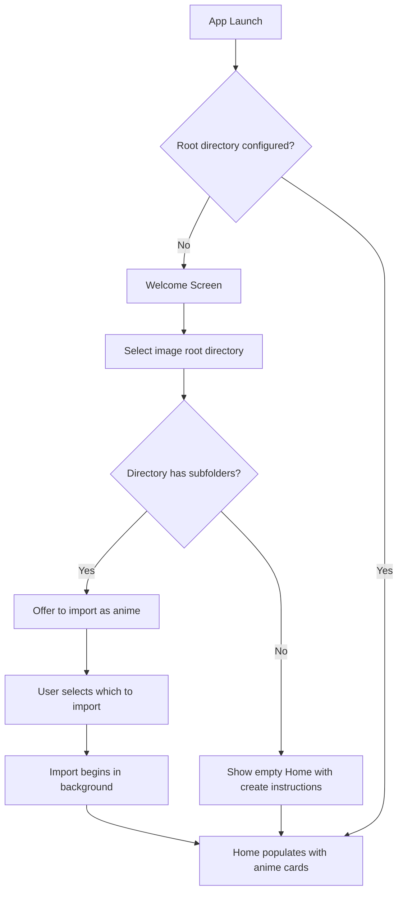
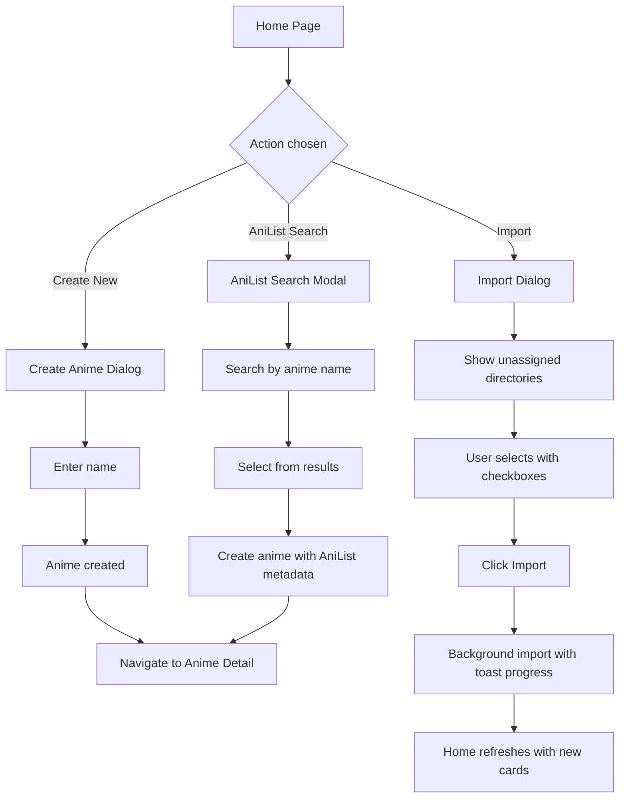
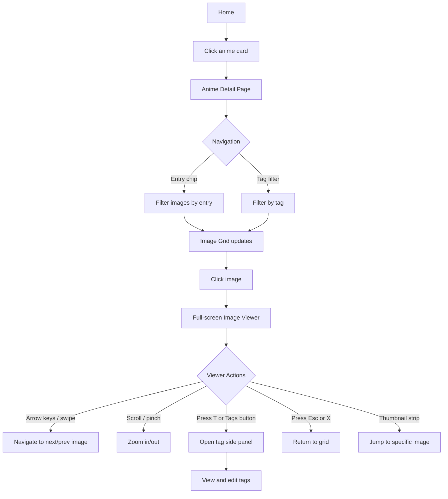
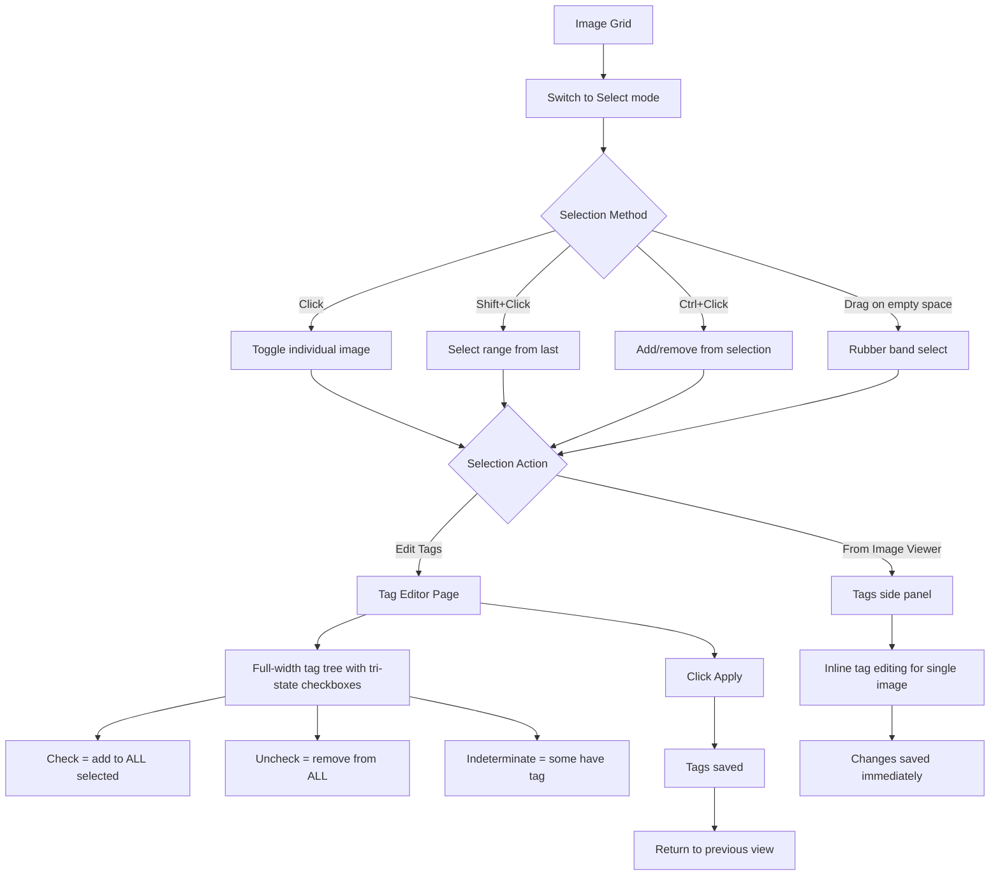
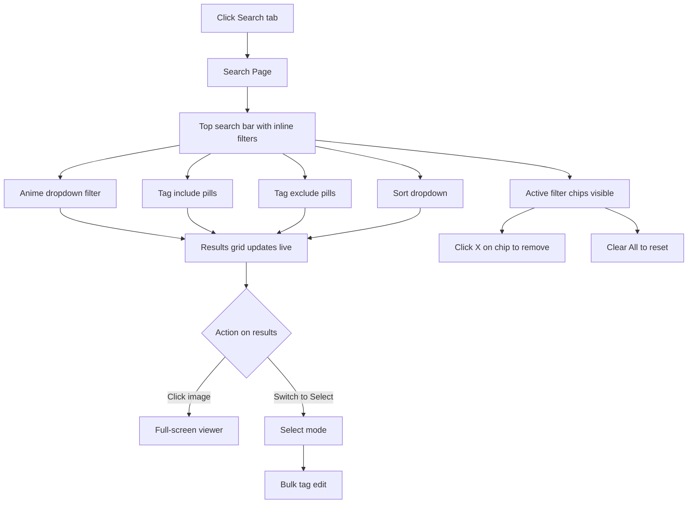
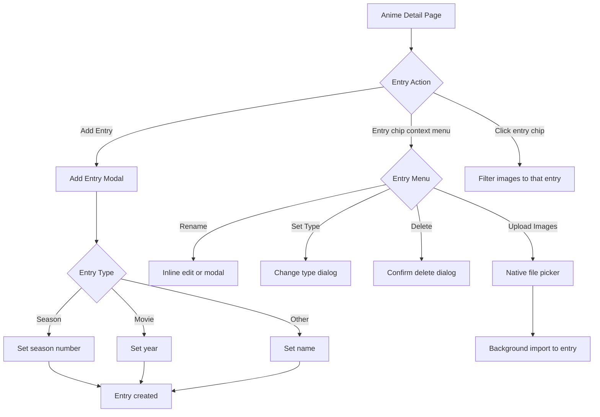
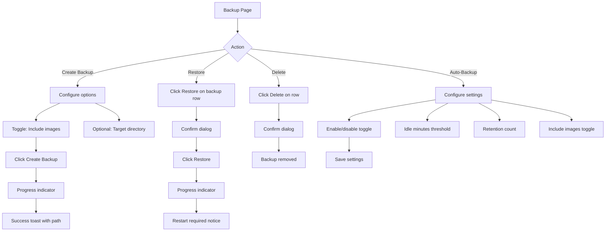
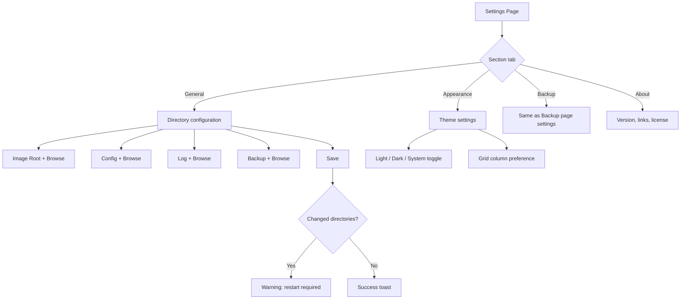

# UX Redesign v2: AnimeVault (Anime Image Viewer/Organizer)

## 1. Design Overview

### Design Philosophy

This redesign v2 takes a fundamentally different approach from v1. Rather than reskinning the existing admin-panel layout, we rethink every screen from scratch, drawing inspiration from the best modern consumer apps:

- **Google Photos** -- Inline filter chips above a full-width results grid. No sidebars on search.
- **Pinterest** -- Masonry grids that fill the viewport. Cards with preview images for discovery.
- **Netflix / Crunchyroll** -- Hero sections with featured content. Horizontal scrollable strips for categories.
- **Spotify** -- Minimal chrome, dark-first design, search as a first-class experience.
- **Linear** -- Command palette (Ctrl+K), keyboard-first, icon rail navigation.
- **AniList** -- Anime profile pages with hero headers and metadata chips.

### What Changed from v1

1. **"Library" renamed to "Home"** everywhere.
2. **Folders page removed entirely.** Users never see or interact with folders. The app manages filesystem organization internally.
3. **ML tag suggestions removed entirely.** No confidence sliders, no suggestion panels, no "ML" references anywhere.
4. **Desktop targets 4K (3840x2160)** instead of 1440px. More columns, more content visible.
5. **Search has NO sidebars.** Inline filter chips directly above full-width results (Google Photos style).
6. **Anime Detail has NO left panel.** Hero header with metadata, horizontal entry chips, full-width masonry grid (AniList/Pinterest style).
7. **Tag Management uses visual cards** with preview images, not a tree+detail panel split.
8. **Navigation reduced to 4 items:** Home, Search, Tags, and a divider before Backup and Settings.
9. **Dark theme as default.** Modern, image-focused aesthetic.
10. **Advanced select mode** with rubber band/lasso selection, shift+click range, ctrl+click toggle.

### Key Design Decisions

1. **No sidebars on content pages** -- Every content page (Search, Anime Detail, Tag Management) uses full-width layouts. Filters and metadata appear as inline chips, hero headers, or horizontal tabs. This maximizes image display area, especially on 4K screens.

2. **Icon Rail sidebar (desktop) + 4-Tab Bottom Bar (mobile)** -- The 80px icon rail on desktop keeps navigation accessible without stealing content space. Mobile uses exactly 4 tabs: Home, Search, Tags, More.

3. **Command Palette (Ctrl+K)** -- Power-user access to any anime, tag, or action without leaving the current page.

4. **Hero headers on detail pages** -- Anime Detail uses a full-width hero banner with cover image background, metadata overlay, and action buttons. This replaces the old left-panel tree approach.

5. **Entry chips, not entry trees** -- Entries appear as horizontal pill tabs, not an expandable sidebar tree. Click a chip to filter the image grid. Much simpler.

6. **Manual tagging only** -- The Image Tag Editor is a clean, full-width tri-state checkbox layout organized by category. No ML panel, no confidence sliders.

7. **Rubber band selection** -- Users can click and drag on empty space to draw a selection rectangle. This is the most intuitive way to select multiple images with a mouse.

### Design Tokens

```
Colors (Dark -- default):
  --background:     #0f0f14
  --surface:        #1e1e2e
  --surface-alt:    #16161e
  --primary:        #818cf8 (Indigo 400)
  --primary-hover:  #6366f1 (Indigo 500)
  --primary-subtle: #312e81 (Indigo 900)
  --text:           #f1f5f9
  --text-secondary: #94a3b8
  --text-muted:     #64748b
  --text-dim:       #475569
  --border:         #2d2d3f
  --danger:         #fca5a5
  --danger-bg:      #3b1a1a
  --success:        #6ee7b7
  --success-bg:     #1a3a2e
  --warning:        #fcd34d
  --warning-bg:     #3b2600

Colors (Light):
  --background:     #fafafa
  --surface:        #ffffff
  --surface-alt:    #f8fafc
  --primary:        #6366f1 (Indigo 500)
  --primary-hover:  #4f46e5 (Indigo 600)
  --primary-subtle: #eef2ff (Indigo 50)
  --text:           #111827
  --text-secondary: #6b7280
  --text-muted:     #9ca3af
  --border:         #e5e7eb

Spacing: 4px base unit (4, 8, 12, 16, 24, 32, 48, 64, 80)
Border Radius: 6px (small), 10px (medium), 16px (large), 24px (pill)
Font: Inter
```

---

## 2. User Flows

### 2.1 First-Time Setup



### 2.2 Adding New Anime



### 2.3 Browsing and Viewing Images



### 2.4 Tagging Images (Manual Only)



### 2.5 Searching and Filtering



### 2.6 Managing Anime Entries



### 2.7 Backup and Restore



### 2.8 Settings



---

## 3. Screen Layouts

### 3.1 Home

**Desktop (3840x2160):** `wireframes/01-home-desktop.svg`
**Mobile (375x812):** `wireframes/01-home-mobile.svg`

**Components:**
- 80px icon rail sidebar (desktop) / 4-tab bottom bar (mobile)
- Hero area with page title, stats, search bar, and quick action buttons
- "Recently Updated" horizontal strip with compact anime cards showing recent activity
- Collection grid: 6 columns on 4K desktop, 2 columns on mobile
- Each card: cover image, anime name, entry count, image count, latest entry badge
- Import progress toast (floating, bottom-right)

**Layout Notes:**
- Netflix/Crunchyroll-inspired layout: hero section at top, then scrollable grid
- No top bar -- the icon rail handles navigation, search is prominent in the hero
- Grid uses CSS Grid with `auto-fill, minmax(520px, 1fr)` for fluid 4K columns
- Cards have generous padding and large cover images
- Dark theme default: `#0f0f14` background, `#1e1e2e` card surfaces

### 3.2 Anime Detail

**Desktop (3840x2160):** `wireframes/02-anime-detail-desktop.svg`
**Mobile (375x812):** `wireframes/02-anime-detail-mobile.svg`

**Components:**
- Full-width hero header with blurred cover image, anime title, metadata, action buttons
- Horizontal entry chip tabs (scrollable): "All Images", "Season 1", "Season 2", etc.
- Inline toolbar: image count, tag filter chip, sort dropdown, view/select toggle
- Full-width masonry image grid (7 columns at 4K, 2 on mobile)
- NO left panel, NO entry tree, NO folder section

**Layout Notes:**
- AniList profile + Pinterest board inspired layout
- Hero header fades to background via gradient overlay
- Entry chips replace the old sidebar tree -- much simpler, horizontal scrollable
- Masonry grid fills entire width minus icon rail (3760px usable at 4K)
- Click entry chip to filter; "All Images" is default selected
- Mobile: compact hero, horizontally scrollable entry chips, 2-column grid

### 3.3 Image Viewer

**Desktop (3840x2160):** `wireframes/03-image-viewer-desktop.svg`
**Mobile (375x812):** `wireframes/03-image-viewer-mobile.svg`

**Components:**
- Full-screen dark overlay (`#0a0a0f`)
- Main image with zoom/pan
- Semi-transparent top bar: close button, image counter, filename, zoom controls, tag panel toggle
- Left/right navigation arrows (large circular buttons)
- Tag side panel (480px, desktop only -- slides in from right)
- Bottom sheet for tags (mobile)
- Bottom thumbnail strip for quick image jumping
- Keyboard shortcut hint bar (bottom-left)
- NO ML suggestions, NO confidence percentages

**Layout Notes:**
- UI elements auto-hide after 3 seconds, reappear on mouse move
- Tag panel shows: assigned tags as colored chips, "Add tag" search field, image details (anime, entry, dimensions, size, date)
- Thumbnail strip at bottom with current image highlighted with indigo border
- Mobile: bottom sheet with drag handle for tag info

### 3.4 Search

**Desktop (3840x2160):** `wireframes/04-search-desktop.svg`
**Mobile (375x812):** `wireframes/04-search-mobile.svg`

**Components:**
- Large search bar at top (centered, prominent, 2880px wide on desktop)
- Inline filter bar directly below search: Anime dropdown, Tag include/exclude pills, Sort dropdown
- "+ Filter" button to add more filters
- "Clear all filters" link
- Results count with filter summary
- View/Select mode toggle
- Full-width masonry results grid (7 columns at 4K)
- Anime name overlay label on each result image
- NO sidebar filter panel, NO folder filter, NO filename filter

**Layout Notes:**
- Google Photos search inspired: search bar hero, inline filters, results fill the screen
- Only three filter types: Anime (dropdown), Tag Include/Exclude (pills), Sort
- Tag include pills have indigo background, tag exclude pills have red background
- Results show anime name as a dark overlay badge on each image
- Mobile: search bar + horizontally scrollable filter chips + 2-column results
- Live-updating results as filters change

### 3.5 Tag Management

**Desktop (3840x2160):** `wireframes/05-tag-management-desktop.svg`
**Mobile (375x812):** `wireframes/05-tag-management-mobile.svg`

**Components:**
- Header with tag count, search bar, "+ New Tag" button
- Tag cards organized by category (Characters, Scenes, Locations, Objects, Uncategorized)
- Each card: preview image strip (top), tag name, image count, anime count, edit button
- Category headers with tag count
- NO tree + detail panel split

**Layout Notes:**
- Pinterest board / Google Photos album inspired: visual cards with preview images
- Cards are 560px wide at 4K, 6+ per row per category
- Preview images show a horizontal strip of 4 sample images at the top of each card
- Mobile: full-width list items with thumbnail + info + chevron, tap to navigate to detail
- Long-press on mobile for action sheet (Rename, Merge, Delete)

### 3.6 Image Tag Editor

**Desktop (3840x2160):** `wireframes/06-image-tag-editor-desktop.svg`
**Mobile (375x812):** `wireframes/06-image-tag-editor-mobile.svg`

**Components:**
- Top: breadcrumb, title "Edit Tags", selected count, Apply/Cancel buttons
- Selected images thumbnail strip (horizontal)
- Tag search field
- Pending changes summary bar (blue background, shows added/removed tags as chips)
- Full-width tag tree with tri-state checkboxes organized in 3 columns by category
- Visual states: green highlight for adding, red highlight for removing, indeterminate dash
- NO ML panel, NO confidence slider, NO suggestion cards

**Layout Notes:**
- Full-width layout, tags spread across 3 columns at 4K (Characters, Scenes, Locations)
- Each row: checkbox + tag name + context info + image count
- Added tags get green background + border, removed tags get red + strikethrough
- Pending changes bar shows at-a-glance what will be applied
- Mobile: single-column scrollable list with same visual states

### 3.7 Backup / Restore

**Desktop (3840x2160):** `wireframes/07-backup-restore-desktop.svg`
**Mobile (375x812):** `wireframes/07-backup-restore-mobile.svg`

**Components:**
- Centered card layout (max-width 1200px on desktop)
- Create Backup card: include images toggle, target directory selector, create button
- Backup History table with date, images flag, size, type badge (auto/manual), actions
- Auto-Backup settings card: enable toggle, idle minutes, retention count, include images toggle
- Confirmation dialogs for restore and delete

**Layout Notes:**
- Centered, focused layout -- not full-width (backup is not a browsing experience)
- "auto" badge in green, "manual" badge in indigo
- Mobile: stacked full-width cards

### 3.8 Settings

**Desktop (3840x2160):** `wireframes/08-settings-desktop.svg`
**Mobile (375x812):** `wireframes/08-settings-mobile.svg`

**Components:**
- Centered layout (max-width 1400px)
- Horizontal section tabs (General, Appearance, Backup, About) -- NOT a left nav panel
- Warning banner for restart-required changes
- Directory fields with Browse buttons
- Save / Reset to Defaults buttons
- Mobile: iOS-style grouped list with section headers

**Layout Notes:**
- Horizontal pill tabs at top instead of sidebar section nav (breaks the "sidebar for everything" pattern)
- Warning banner is amber/yellow with border
- Mobile uses native-feeling grouped list pattern with chevrons

### 3.9 Select Mode

**Desktop (3840x2160):** `wireframes/09-select-mode-desktop.svg`

**Components:**
- Selection action bar (replaces normal toolbar, indigo background)
- Selected count, Select All, Clear buttons
- Actions: Edit Tags button
- Done button to exit
- Checkbox overlays on all images (filled for selected, empty for unselected)
- Selected images: indigo border (4px) + tint overlay (15% opacity)
- **Rubber band rectangle**: dashed indigo border, semi-transparent fill
- Images inside rubber band: dashed border + slight tint (being selected)
- Mouse cursor shown at drag endpoint
- Keyboard/mouse hint bar at bottom

**Behaviors:**
- **Click**: Toggle individual image selection
- **Shift+Click**: Select all images between last selected and clicked image
- **Ctrl+Click (Cmd on Mac)**: Add or remove single image without affecting others
- **Drag on empty space**: Draw rubber band rectangle; all images intersecting it get selected
- **Esc**: Exit select mode
- **Ctrl+A**: Select all images

### 3.10 Navigation Pattern

**Reference:** `wireframes/10-navigation-pattern.svg`

**Desktop Icon Rail (80px):**
- App logo at top
- Primary: Home, Search, Tags (above divider)
- Secondary: Backup, Settings (below divider)
- Expands to 200px on hover with text labels
- Ctrl+K command palette hint at bottom of expanded state

**Mobile Bottom Bar (4 tabs):**
- Home, Search, Tags, More
- "More" opens a bottom sheet with: Backup and Restore, Settings, Theme toggle, About
- Active tab: indigo text + pill background
- Inactive: gray icon + text

---

## 4. Component Specifications

### 4.1 Anime Card

**States:**
- Default: Dark surface background, cover image, anime name, stats
- Hover: Slight scale (1.02), border glow, surface elevation change
- Active/Pressed: Scale down (0.98)
- Loading: Skeleton placeholder for cover + text
- Empty: Gradient placeholder, "No images" text

**Behavior:**
- Click navigates to Anime Detail
- Right-click opens context menu (Rename, Delete)
- Long-press on mobile opens action sheet

### 4.2 Image Thumbnail

**States:**
- Default: Image with slight border radius (12px), no decoration
- Hover: Subtle brightness overlay, pointer cursor
- Selected (select mode): Indigo border (4px), checkbox overlay (top-left), 15% tint
- Rubber band intersecting: Dashed indigo border, 10% tint
- Loading: Skeleton with aspect ratio preserved
- Error: Broken image icon with retry option

**Behavior:**
- View mode: click opens full-screen viewer
- Select mode: click toggles selection
- Rubber band: automatically selected when rectangle intersects
- Lazy-loaded with intersection observer

### 4.3 Tag Chip

**States:**
- Default: Category-colored background + border
- Hover: Slightly darker background
- Active: Stronger border
- Removable: X button appears on hover/focus
- Include filter: Indigo background, "+" prefix
- Exclude filter: Red background, "-" prefix

**Category Colors (Dark theme):**
- Character: `#312e81` border `#818cf8` text `#818cf8`
- Scene: `#1a3a2e` border `#6ee7b7` text `#6ee7b7`
- Location: `#3b2600` border `#fcd34d` text `#fcd34d`
- Object: `#3b1a1a` border `#fca5a5` text `#fca5a5`
- Uncategorized: `#1e1e2e` border `#64748b` text `#94a3b8`

### 4.4 Tri-State Checkbox

**States:**
- Unchecked: Transparent fill, dim border (`#2d2d3f`)
- Checked: Primary fill (`#818cf8`), white checkmark
- Indeterminate: Transparent fill, primary border, horizontal dash
- Adding (pending): Green background (`#0a2e1a`), green checkmark
- Removing (pending): Red background (`#2e0a0a`), red border, strikethrough text
- Hover: Row background highlight
- Disabled: Reduced opacity, no pointer

**Behavior:**
- Unchecked -> click -> Checked (add tag to ALL selected images)
- Checked -> click -> Unchecked (remove from ALL)
- Indeterminate -> click -> Checked (add to remaining)

### 4.5 Entry Chip

**States:**
- Default: Dark surface background, dim border, muted text
- Active/Selected: Primary fill, white text
- Hover: Border brightens

**Behavior:**
- Click filters image grid to that entry
- "All Images" is always the first chip (default selected)
- Right-click / long-press for context menu: Rename, Set Type, Upload Images, Delete
- Horizontally scrollable container

### 4.6 Search Filter Chip

**States:**
- Include: Indigo background with indigo border, "+" prefix
- Exclude: Red background with red border, "-" prefix
- Anime filter: Surface background with border, dropdown indicator
- Removable: X button at end

**Behavior:**
- Click X removes filter
- Anime chip opens dropdown to change selection
- Tag chips can be toggled between include/exclude

### 4.7 Bottom Tab Bar Item

**States:**
- Default: Gray icon + label
- Active: Primary color icon + label, subtle pill background
- Badge: Notification dot for import progress

### 4.8 Command Palette

**States:**
- Closed: Not visible
- Open: Centered modal with search input + results list
- Loading: Spinner in results area
- Empty: "No results" message

**Behavior:**
- Ctrl+K to open, Esc to close
- Type to search (debounced 200ms)
- Results grouped: Anime, Tags, Actions
- Arrow keys to navigate, Enter to select
- Recent searches shown when empty

### 4.9 Rubber Band Selection Rectangle

**States:**
- Drawing: Semi-transparent indigo fill (8% opacity), dashed indigo border (2px)
- Absent: Not rendered

**Behavior:**
- Initiated by mousedown on empty grid space (not on an image)
- Extends to current mouse position during drag
- All images whose bounding boxes intersect the rectangle are "pending selected"
- On mouseup, pending selections become actual selections
- Works with Ctrl held to add to existing selection (without clearing)

---

## 5. Select Mode Specification

### 5.1 Entering Select Mode
- Click "Select" toggle in the toolbar
- Or: Ctrl+Click on any image in view mode (enters select mode + selects that image)
- Select mode replaces the normal toolbar with the selection action bar (indigo background)

### 5.2 Selection Methods

**Click (toggle):**
- Click an image to toggle its selection state
- Deselects if already selected, selects if not

**Shift+Click (range):**
- Selects all images between the last selected image and the clicked image
- Range is determined by grid order (left-to-right, top-to-bottom)
- Does not deselect previously selected images outside the range

**Ctrl+Click / Cmd+Click (additive toggle):**
- Toggles a single image without affecting other selections
- Useful for picking non-contiguous images

**Rubber Band / Lasso Selection (drag):**
- Click and drag on empty grid space (not on an image) to start drawing a selection rectangle
- All images whose bounding boxes intersect the rectangle are visually marked as "pending"
- On mouse release, all intersecting images are added to the selection
- If Ctrl is held during drag, adds to existing selection; otherwise replaces selection
- Visual: semi-transparent indigo rectangle with dashed border

**Select All (Ctrl+A):**
- Selects all images in the current view (respecting any active entry/tag filters)

### 5.3 Visual Feedback
- **Selected**: 4px indigo border + 15% indigo tint overlay + filled checkbox
- **Pending (rubber band)**: 3px dashed indigo border + 10% tint + partially filled checkbox
- **Unselected**: Empty checkbox overlay (visible only in select mode)
- **Selection action bar**: Full-width indigo bar with count, Select All, Clear, Edit Tags, Done

### 5.4 Exiting Select Mode
- Click "Done" in the action bar
- Press Esc
- Navigate away from the page

### 5.5 Mobile Select Mode
- Enter by tapping "Select" toggle
- Tap to toggle individual selection
- No rubber band drag (not natural on touch)
- Long-press and drag to select multiple (future enhancement)
- Shift+tap not available (no keyboard on mobile typically)

---

## 6. Interaction Patterns

### 6.1 Image Grid Scrolling
- Virtual scrolling for grids over 100 images
- Progressive image loading with quality based on grid cell size
- Scroll position preserved when returning from image viewer
- Pull-to-refresh on mobile

### 6.2 Keyboard Navigation
| Key | Context | Action |
|-----|---------|--------|
| Ctrl+K | Global | Open command palette |
| Esc | Viewer | Close viewer |
| Esc | Select mode | Exit select mode |
| Arrow Left/Right | Viewer | Previous/next image |
| +/- | Viewer | Zoom in/out |
| T | Viewer | Toggle tag panel |
| Space | Viewer | Start/stop slideshow |
| Ctrl+A | Grid (select mode) | Select all |
| Delete | Grid (selected) | Prompt to remove |

### 6.3 Gesture Support (Mobile)
| Gesture | Context | Action |
|---------|---------|--------|
| Swipe left/right | Viewer | Navigate images |
| Pinch | Viewer | Zoom |
| Swipe down | Viewer | Close viewer |
| Swipe right | Any page | Navigate back |
| Pull down | Grid/List | Refresh |
| Long press | Card/Image | Open action sheet |

### 6.4 Transitions and Animations
- Page transitions: Shared element animation for image -> viewer
- Sidebar expand: 200ms ease-out width transition
- Modal entry: Scale from 0.95 + fade in, 150ms
- Tag chip add/remove: Scale bounce (0 -> 1.05 -> 1), 200ms
- Image selection: Border + tint with 100ms transition
- Rubber band: Real-time rectangle rendering at 60fps
- Toast notifications: Slide up from bottom-right, auto-dismiss 5s

---

## 7. Responsive Design

### 7.1 Breakpoint System

| Breakpoint | Width | Layout |
|------------|-------|--------|
| Mobile | 0 - 639px | Single column, bottom tabs |
| Tablet | 640 - 1023px | 2-3 column layouts, bottom tabs |
| Desktop | 1024 - 2559px | Icon rail + content |
| 4K | 2560px+ | Icon rail + expansive multi-column, full layout |

### 7.2 Navigation Transformation

**Desktop (1024px+):**
- 80px icon rail sidebar, expands to 200px on hover
- No top bar (search is in hero sections)
- Breadcrumb navigation on detail pages

**Tablet (640-1023px):**
- Icon rail at 80px, no hover-expand
- Image grids: 3 columns
- Filter chips horizontally scrollable

**Mobile (< 640px):**
- 4-tab bottom bar (Home, Search, Tags, More)
- No sidebar
- Full-width layouts
- Image grids: 2 columns
- Panels become full-page views or bottom sheets

### 7.3 Image Grid Adaptation

| Breakpoint | Columns | Min Card Width |
|------------|---------|----------------|
| Mobile | 2 | 160px |
| Tablet | 3-4 | 200px |
| Desktop | 5-6 | 280px |
| 4K | 6-8 | 480px |

Grid uses `auto-fill, minmax(var(--min-card-width), 1fr)` for fluid column count.

### 7.4 Touch Target Sizes
- Minimum touch target: 44x44px (Apple HIG)
- Button minimum height: 36px (desktop), 44px (mobile)
- List item minimum height: 48px
- Checkbox/radio: 24x24px visual, 44x44px tap area
- Tab bar items: 48px height minimum

### 7.5 Panel Behavior

| Element | Desktop | Tablet | Mobile |
|---------|---------|--------|--------|
| Sidebar nav | Icon rail (80px) | Icon rail (80px) | 4-tab bottom bar |
| Search filters | Inline chips | Inline chips | Scrollable chips |
| Anime entries | Horizontal chips | Horizontal chips | Horizontal chips |
| Tag management | Card grid | Card grid | List view |
| Image viewer tags | Right panel (480px) | Bottom panel | Bottom sheet |

---

## 8. Accessibility Requirements

### 8.1 Keyboard Navigation
- [x] All interactive elements focusable via Tab
- [x] Focus visible indicator: 2px primary ring with 2px offset
- [x] Skip-to-content link as first focusable element
- [x] Arrow keys navigate within component groups (tabs, grid)
- [x] Enter/Space activate buttons and toggles
- [x] Escape closes modals, drawers, popups, and select mode
- [x] Focus trapped within open modals
- [x] Focus returned to trigger element on modal close

### 8.2 Screen Reader Support
- [x] Semantic HTML: `nav`, `main`, `header`, `section`, `aside`
- [x] ARIA landmarks for all major regions
- [x] Images have descriptive alt text (filename + tags)
- [x] Live regions for toast notifications and progress updates
- [x] `aria-selected` on grid items in select mode
- [x] `aria-checked` with `"mixed"` value for indeterminate checkboxes
- [x] `role="dialog"` with `aria-labelledby` for all modals
- [x] Image count announcements when filtering changes results
- [x] Rubber band selection announces count of newly selected images

### 8.3 Color Contrast
- [x] Text contrast: minimum 4.5:1 (AA) for body text
- [x] Large text contrast: minimum 3:1 (AA)
- [x] Non-text contrast: minimum 3:1 for borders and icons
- [x] Selected state not reliant on color alone (uses border + background)
- [x] Tag categories distinguishable by shape/icon in addition to color
- [x] Both light and dark themes tested for contrast compliance

### 8.4 Focus Indicators
- Default: 2px solid `#818cf8` with 2px offset, visible in both themes
- High contrast mode: 3px solid ring
- Focus-visible only (no focus ring on mouse click)

### 8.5 Motion Preferences
- `prefers-reduced-motion`: disable all transitions and animations
- Rubber band selection still works but without animation (instant rectangle)
- Slideshow respects user preference
- Progress bars use static states instead of animation

### 8.6 Additional Considerations
- Text resizable to 200% without horizontal scrolling
- Touch targets meet 44x44px minimum
- Form fields have visible labels (not placeholder-only)
- Error messages associated with form fields via `aria-describedby`
- Destructive actions require explicit confirmation

---

## 9. Implementation Technology Recommendations

### Component Library
Replace MUI with:
- **Radix UI** -- Headless, accessible primitives
- **Tailwind CSS** -- Utility-first styling, dark mode support
- **tailwind-merge** -- Merge utility for component variants
- **class-variance-authority (cva)** -- Type-safe component variants

### Key Libraries
- `react-window` or `@tanstack/react-virtual` -- Virtualized image grid
- `react-zoom-pan-pinch` -- Image viewer zoom
- `cmdk` -- Command palette (Linear-style)
- `lucide-react` -- Icon set
- `sonner` -- Toast notifications
- `zustand` -- Lightweight state management

### File Structure Suggestion
```
frontend/src/
  components/
    ui/           -- Base UI components (button, input, card, dialog, etc.)
    layout/       -- Shell, sidebar, bottom-tabs
    image/        -- ImageGrid, ImageCard, ImageViewer, ThumbnailStrip, RubberBandSelect
    tag/          -- TagChip, TagTree, TagCheckbox, TagEditor
    anime/        -- AnimeCard, EntryChip
    search/       -- CommandPalette, FilterChip, SearchBar
  pages/
    home/         -- AnimeListPage
    anime/        -- AnimeDetailPage
    search/       -- SearchPage
    tags/         -- TagListPage, ImageTagEditorPage
    backup/       -- BackupPage
    settings/     -- SettingsPage
  hooks/          -- useImageGrid, useSelection, useRubberBand, useSearch, useTags
  stores/         -- zustand stores for global state
  styles/         -- Tailwind config, global styles, theme tokens
```

---

## Wireframe File Index

All wireframes are in `docs/ux-redesign/wireframes/`:

| File | Description |
|------|-------------|
| `01-home-desktop.svg` | Home with hero + collection grid (3840x2160) |
| `01-home-mobile.svg` | Home with bottom tabs (375x812) |
| `02-anime-detail-desktop.svg` | Hero header + entry chips + masonry grid (3840x2160) |
| `02-anime-detail-mobile.svg` | Compact hero + chips + 2-col grid (375x812) |
| `03-image-viewer-desktop.svg` | Full-screen viewer with tag panel (3840x2160) |
| `03-image-viewer-mobile.svg` | Full-screen viewer with bottom sheet (375x812) |
| `04-search-desktop.svg` | Inline filters + full-width results (3840x2160) |
| `04-search-mobile.svg` | Search bar + filter chips + results (375x812) |
| `05-tag-management-desktop.svg` | Tag cards by category with previews (3840x2160) |
| `05-tag-management-mobile.svg` | Tag list with thumbnails (375x812) |
| `06-image-tag-editor-desktop.svg` | Full-width tri-state checkboxes, no ML (3840x2160) |
| `06-image-tag-editor-mobile.svg` | Single-column tag checkboxes (375x812) |
| `07-backup-restore-desktop.svg` | Centered card layout (3840x2160) |
| `07-backup-restore-mobile.svg` | Stacked cards (375x812) |
| `08-settings-desktop.svg` | Horizontal section tabs + form (3840x2160) |
| `08-settings-mobile.svg` | iOS-style settings list (375x812) |
| `09-select-mode-desktop.svg` | Rubber band selection shown (3840x2160) |
| `10-navigation-pattern.svg` | Icon rail + mobile bottom bar comparison |
